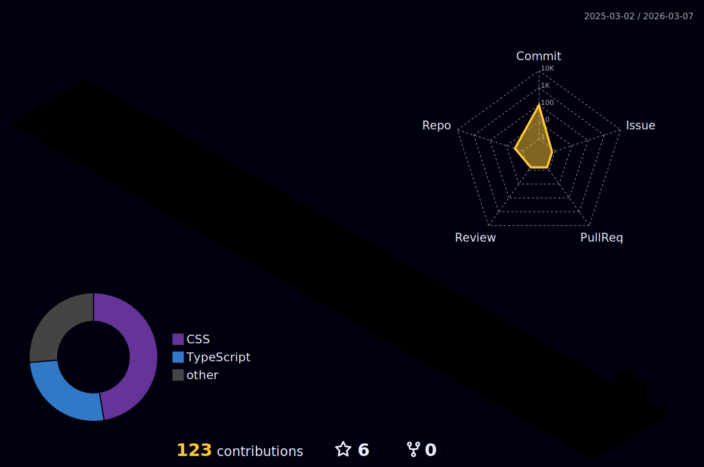

# ABOUT ME

### Hi I'm M.Mehrani 

### Welcome to my  Profile

 

    
    
    
    
    
    

  

    
    
    
    
     
     

<!--
**mohammadmehrani/readme** is a ✨ _special_ ✨ repository because its `README.md` (this file) appears on your GitHub profile.

Here are some ideas to get you started:

-->

## ⚡ Platforms

## ⚡ Tec Stacks
 

  

## 🌎 Find me
  - Linkdin Account: * <a href="https://www.linkedin.com/in/mohammadmehrani/">Linkdin</a> *✍🏾
- blog: click [My Blog](https://m-mehrani.ir/):memo:    
- email:<a href="mailto:mehrani1992@gmail.com">Email</a>
## 🚀 Ability
<!-- BLOG-POST-LIST:START -->
                                      
 
<!-- BLOG-POST-LIST:END -->

## 🌎 Visitors

  