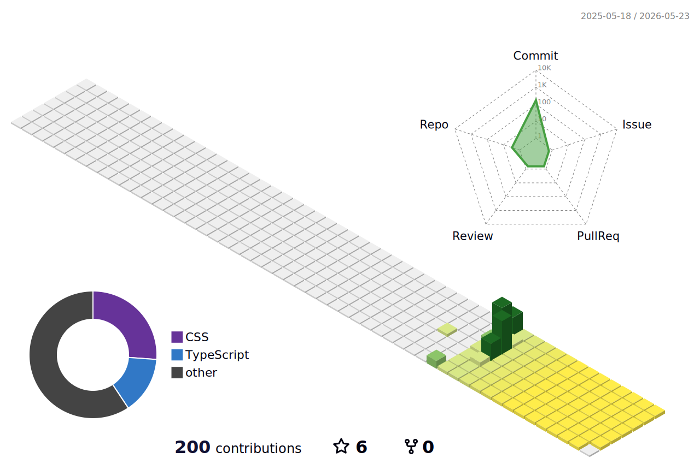

# Mohammad Mehrani

  

  
  
  
  
  
  

  
  
  

## About Me

- Backend and automation focused developer.
- Building practical systems with clean architecture.
- Interested in Python, Go, cloud tools, and DevOps workflows.

## Tech Stack

  

## Project Performance Report

  
  

  

  

  

  
  

## Contribution Views

  

# 💻 ترمینال Mohammad Mehrani

┌─[mohammad@kali]─[~]
└──╼ $ help

    ╔══════════════════════════════════════════════════════════════════╗
    ║                 Linux Terminal Simulation v2.0                   ║
    ╠══════════════════════════════════════════════════════════════════╣
    ║  📌 Basic Commands:                                              ║
    ║     about, skills, experience, projects, contact, help, clear    ║
    ║                                                                  ║
    ║  ⭐ Admin Hidden Commands:                                        ║
    ║     secret, token, sysinfo, easter, network, backup, audit,      ║
    ║     config, service, monitor, deploy, health, logs, docker,      ║
    ║     k8s, terraform, ansible, ci, cd, vault, grafana, prometheus  ║
    ║                                                                  ║
    ║  💡 Type a command and press Enter to execute.                   ║
    ╚══════════════════════════════════════════════════════════════════╝

┌─[mohammad@kali]─[~]
└──╼ $ about

    👤 **Mohammad Mehrani** – DevOps Engineer with 6+ years of experience
    in CI/CD, Kubernetes, cloud infrastructure, and automation.
    Passionate about building secure and scalable systems.

┌─[mohammad@kali]─[~]
└──╼ $ skills

    🛠️ **Technical Skills:**
    • DevOps Engineering ................ 92%
    • Kubernetes / Docker .............. 88%
    • CI/CD (GitHub Actions, GitLab) ... 86%
    • Cloud (AWS, Azure, GCP) .......... 83%
    • Terraform / Ansible .............. 85%
    • Prometheus / Grafana / Loki ...... 80%
    • Linux, Python, Bash, Helm, ArgoCD, Vault, GitOps

┌─[mohammad@kali]─[~]
└──╼ $ experience

    💼 **Work Experience:**
    🔹 Infrastructure Technical Support @ PARSPACK (ABRHA)
    🔹 Full Stack Developer @ Tajhiz Niroo Zangan (TNZ Oil)
    🔹 Support & Maintenance @ Enermonde Co.
    🔹 Software Technical Expert @ Sama Samaneh Co.

┌─[mohammad@kali]─[~]
└──╼ $ projects

    🚀 **Featured Projects:**
    • **dashyar** – Interactive dashboard platform with TypeScript
    • **Project-Aurora** – Azure infrastructure automation (Terraform/Ansible)
    • **Cloud Migration Pipeline** – Multi-stage pipeline with rollback
    • **Container Hardening** – Security policies & image scanning
    • **Observability Stack** – Monitoring with Prometheus + Loki + Grafana

┌─[mohammad@kali]─[~]
└──╼ $ contact

    📬 **Contact & Repository:**
    📧 Email: admin@m-mehrani.ir
    📍 Location: Tehran, Iran
    💼 Remote / Full-time available
    🔗 GitHub: https://github.com/mohammadmehrani
    🌐 Portfolio: https://mohammadmehrani.github.io
    📦 Repository: https://mohammadmehrani.github.io

┌─[mohammad@kali]─[~]
└──╼ $ secret

    🔐 Admin secret: 5e884898da28047151d0e56f8dc6292773603d0d6aabbdd62a11ef721d1542d8

┌─[mohammad@kali]─[~]
└──╼ $ token

    🎟️ Admin token: GHF83-jdks9-AdminMehrani-2390x

┌─[mohammad@kali]─[~]
└──╼ $ sysinfo

    🖥️ **System Information:**
    • Kernel: Linux Terminal v2.0 | kali-rolling
    • Shell: custom-js 1.2.0
    • Uptime: 14 days, 8 hours, 22 minutes
    • User: mohammad@kali
    • Memory Usage: 4.2 GB / 15.6 GB

┌─[mohammad@kali]─[~]
└──╼ $ easter

    🥚 **Easter Egg Found!**
    "The only way to go fast is to go well." — Robert C. Martin

┌─[mohammad@kali]─[~]
└──╼ $ network

    🌐 **Network Status:**
    • Interface: eth0 — Active
    • IP Address: 192.168.1.100
    • Gateway: 192.168.1.1
    • DNS: 8.8.8.8, 1.1.1.1
    • Packet Loss: 0% — Connection Stable

┌─[mohammad@kali]─[~]
└──╼ $ backup

    💾 **Backup Report:**
    • Last Backup: 2025-06-06 02:30 UTC
    • Status: ✅ Successful
    • Size: 2.4 GB
    • Location: s3://backup-mohammad/weekly/

┌─[mohammad@kali]─[~]
└──╼ $ audit

    📋 **System Audit Log:**
    • Failed Login Attempts: 0
    • Active Sessions: 1
    • Open Ports: 22 (SSH), 80 (HTTP), 443 (HTTPS)
    • Firewall Status: ✅ Active

┌─[mohammad@kali]─[~]
└──╼ $ config

    ⚙️ **Current Configuration:**
    • Shell: zsh 5.8
    • Theme: kali-terminal-dark
    • Aliases: ll='ls -alh', gs='git status'
    • PATH: /usr/local/bin:/usr/bin:/bin

┌─[mohammad@kali]─[~]
└──╼ $ service

    🔧 **Service Status:**
    • docker.service: ● Active (running)
    • kubelet.service: ● Active (running)
    • nginx.service: ● Active (running)
    • prometheus.service: ● Active (running)

┌─[mohammad@kali]─[~]
└──╼ $ monitor

    📊 **System Monitor:**
    • CPU Usage: 23% | ████░░░░░░
    • Memory Usage: 42% | ██████░░░░
    • Disk Usage: 67% | ██████████░░
    • Network In/Out: 1.2 MB/s / 0.8 MB/s

┌─[mohammad@kali]─[~]
└──╼ $ deploy

    🚀 **Deployment Pipeline:**
    • Environment: Production
    • Status: ✅ Success
    • Commit: a3f2b91 — "Fix critical bug"
    • Deployment Time: 2.3 seconds

┌─[mohammad@kali]─[~]
└──╼ $ health

    🩺 **System Health Check:**
    • API Gateway: ✅ Operational
    • Database: ✅ Operational
    • Cache (Redis): ✅ Operational
    • Message Queue: ✅ Operational

┌─[mohammad@kali]─[~]
└──╼ $ logs

    📜 **Recent Logs (tail -5):**
    [2025-06-06 10:23:45] INFO: User authentication successful
    [2025-06-06 10:24:12] WARN: High memory usage detected
    [2025-06-06 10:25:01] INFO: Backup completed successfully
    [2025-06-06 10:26:33] ERROR: Connection timeout retrying
    [2025-06-06 10:27:19] INFO: Service restarted

┌─[mohammad@kali]─[~]
└──╼ $ docker

    🐳 **Docker Status:**
    • Containers: 5 running, 2 stopped
    • Images: 23 total
    • Volumes: 8 active
    • Networks: 3 custom

┌─[mohammad@kali]─[~]
└──╼ $ k8s

    ☸️ **Kubernetes Cluster:**
    • Nodes: 3 (2 ready, 1 maintenance)
    • Pods: 47 running
    • Services: 12 active
    • Namespaces: dev, staging, prod

┌─[mohammad@kali]─[~]
└──╼ $ terraform

    🏗️ **Terraform State:**
    • Resources: 87 managed
    • Workspace: production
    • Last Apply: 2025-06-06 09:15 UTC
    • Changes: 0 pending

┌─[mohammad@kali]─[~]
└──╼ $ ansible

    📦 **Ansible Report:**
    • Inventory: 24 hosts
    • Playbooks: 12 available
    • Last Run: 2025-06-06 04:00 UTC — ✅ Successful
    • Failed Tasks: 0

┌─[mohammad@kali]─[~]
└──╼ $ ci

    🔄 **CI/CD Pipeline (GitHub Actions):**
    • Workflows: 8 active
    • Last Run: main — ✅ Passed (2m 34s)
    • Test Coverage: 87%
    • Artifacts: 12 stored

┌─[mohammad@kali]─[~]
└──╼ $ cd

    🔐 **Vault Secrets Status:**
    • Secrets: 34 stored
    • Dynamic Leases: 12 active
    • Audit Logs: ✅ Enabled
    • Seal Status: ✅ Unsealed

┌─[mohammad@kali]─[~]
└──╼ $ grafana

    📈 **Grafana Dashboard:**
    • Active Dashboards: 8
    • Data Sources: Prometheus, Loki
    • Alerts: 3 firing, 2 pending
    • Users: 5 active

┌─[mohammad@kali]─[~]
└──╼ $ prometheus

    ⏱️ **Prometheus Metrics:**
    • Up: 15 targets
    • Down: 1 target
    • Scrape Duration: 2.3s average
    • Storage: 42 GB used

┌─[mohammad@kali]─[~]
└──╼ $ clear

    ✅ Terminal cleared.

┌─[mohammad@kali]─[~]
└──╼ $ █

