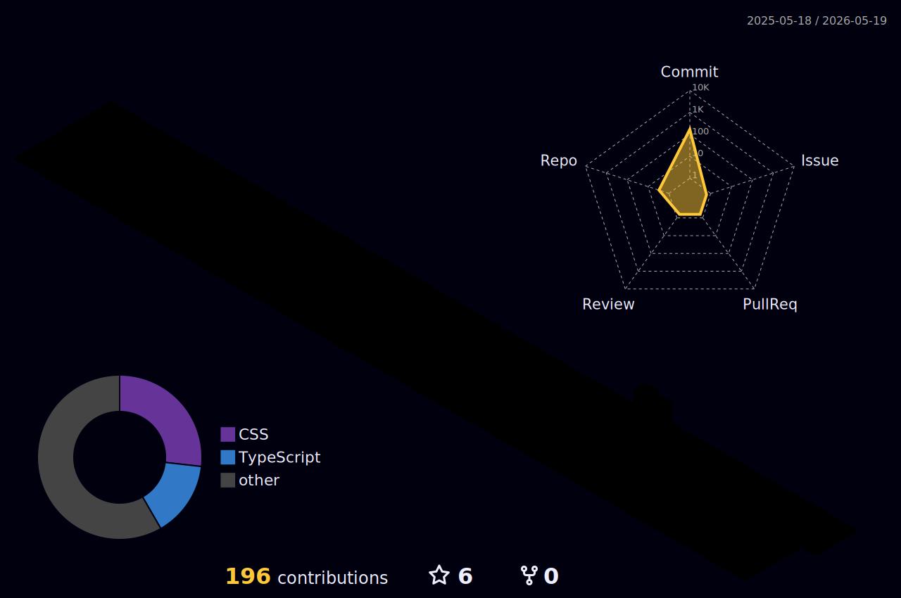

# Mohammad Mehrani

<p align="center">
  
</p>

<p align="center">
  <a href="https://github.com/mohammadmehrani">
    
  </a>
  <a href="https://www.linkedin.com/in/mohammadmehrani/">
    
  </a>
  <a href="https://t.me/mohammad_mehrani">
    
  </a>
  <a href="https://iodeck.ir/">
    
  </a>
  <a href="mailto:mehrani1992@gmail.com">
    
  </a>
  <a href="https://gitlab.com/mohammadmehrani">
    
  </a>
</p>

<p align="center">
  
  
  
</p>

## About Me

- Backend and automation focused developer.
- Building practical systems with clean architecture.
- Interested in Python, Go, cloud tools, and DevOps workflows.

## Tech Stack

<p align="center">
  
</p>

## Project Performance Report

<!-- <p align="center">
  
  
</p> -->

<p align="center">
  
</p>

<p align="center">
  
</p>

<p align="center">
  
</p>

<p align="center">
  
  
</p>

<p align="center">
  
</p>

<p align="center">
  <a href="https://mohammadmehrani.github.io/achievements">
    
  </a>
</p>

## ⚡ Extraordinary Automation Pipeline

<p align="center">
  
  
  
  
  
</p>

This profile is powered by an **Extraordinary Workflow System** combining **n8n** + **GitHub Actions** + **PostgreSQL** + **Redis** for intelligent automation:

- **3D Contribution Graphs**: Auto-generated daily (06:00 & 18:00 UTC) with SVG optimization
- **Blog Integration**: Fetches latest posts from [iodeck.ir](https://iodeck.ir) every 6 hours
- **Activity Analytics**: Python-powered analysis of GitHub events, growth metrics, and trends
- **Smart Notifications**: Telegram alerts for significant events and daily summaries
- **State Management**: Redis caching + PostgreSQL historical snapshots for trend tracking
- **Error Resilience**: Auto-recovery with Telegram error alerts

### 🔧 How to Run the n8n Workflow

```bash
# 1. Start the infrastructure
docker compose -f infra/docker-compose.yml up -d

# 2. Access n8n at http://localhost:5678
# 3. Import workflows/n8n-extraordinary-workflow.json
# 4. Configure env vars in infra/.env
# 5. Activate the workflow

# 6. Set GitHub Secrets for webhook integration:
#    - N8N_WEBHOOK_URL: http://your-server:5678/webhook/github-profile-events
```

### 🏗 Architecture Overview

```
                         ┌─────────────────────────┐
                         │      Telegram Bot        │
                         │   (Interactive Commands)  │
                         └──────────┬──────────────┘
                                    │
GitHub Events ──► GitHub Actions ──► n8n Webhook ──► Telegram Alerts
       │              │                  │
       │         ┌────┴─────┐      ┌─────┴──────┐
       │         │ Pipeline │      │  n8n Core  │
       │         │Orchestrat│      │  - Process │
       │         │ er       │      │  - Analyze │
       │         └────┬─────┘      │  - Route   │
       │              │            └─┬──┬──┬──┬─┘
       │              ▼              │  │  │  │
       │         ┌──────────┐  ┌────┘  │  │  └──────┐
       │         │  Badges  │  ▼       ▼  ▼         ▼
       │         │ Generator│ Redis Telegram  Python Runner
       │         └──────────┘ (Cache) (Alert)  (Reports)
       │                          │
       │                     ┌────┴─────┐
       │                     │PostgreSQL │
       │                     │(History)  │
       │                     └──────────┘
       │
       └──► Profile Stats ──► SVG Graphs ──► README
                                    │
                              ┌─────┴────┐
                              │  Health  │
                              │  Monitor │
                              └──────────┘
```

### 📋 Project Structure

```
📁 mohammadmehrani/
├── 📄 README.md                    # Profile page
├── 📁 .github/workflows/
│   ├── 📄 profile-3d.yml           # Enhanced 3D graph generator
│   ├── 📄 blog-post-workflow.yml   # Enhanced blog fetcher
│   ├── 📄 extraordinary-pipeline.yml # 🚀 Main orchestrator
│   ├── 📄 dynamic-badges.yml       # Dynamic badge generator
│   └── 📄 health-monitor.yml       # Health check system
├── 📁 infra/
│   ├── 📄 docker-compose.yml       # n8n + PostgreSQL + Redis
│   ├── 📄 Dockerfile.python-runner # Custom Python environment
│   ├── 📄 init-schema.sql          # Database schema
│   └── 📄 .env                     # Environment config
├── 📁 workflows/
│   ├── 📄 n8n-extraordinary-workflow.json  # Main n8n workflow (31 nodes)
│   └── 📄 n8n-telegram-bot-subworkflow.json # Telegram bot workflow
├── 📁 scripts/
│   ├── 📄 generate_profile_report.py    # Python analytics engine
│   ├── 📄 webhook-handler.js            # Webhook event handler
│   ├── 📄 setup-infra.ps1              # One-click setup script
│   └── 📄 test-webhook.ps1             # Webhook test simulator
└── 📁 profile-3d-contrib/              # Generated SVG graphs
```

### 💬 Telegram Bot Commands

| Command | Description |
|---------|-------------|
| `/start` | Welcome message & introduction |
| `/stats` | Current GitHub profile statistics |
| `/activity` | Recent activity analysis (coming soon) |
| `/streak` | Current contribution streak |
| `/languages` | Top programming languages with charts |
| `/help` | Show all available commands |

### 🚀 Quick Start

```bash
# Option 1: One-click setup (Windows)
powershell -ExecutionPolicy Bypass -File scripts/setup-infra.ps1

# Option 2: Manual setup
docker compose -f infra/docker-compose.yml up -d

# Option 3: Build custom Python runner
docker build -f infra/Dockerfile.python-runner -t profile-python-runner .

# Test the webhook
.\scripts\test-webhook.ps1 -EventType push
```

### 🔧 GitHub Repository Secrets

| Secret | Description |
|--------|-------------|
| `N8N_WEBHOOK_URL` | n8n webhook endpoint URL |
| `GITHUB_TOKEN` | Auto-provided by GitHub Actions |

## Contribution Views

<p align="center">
  
</p>


