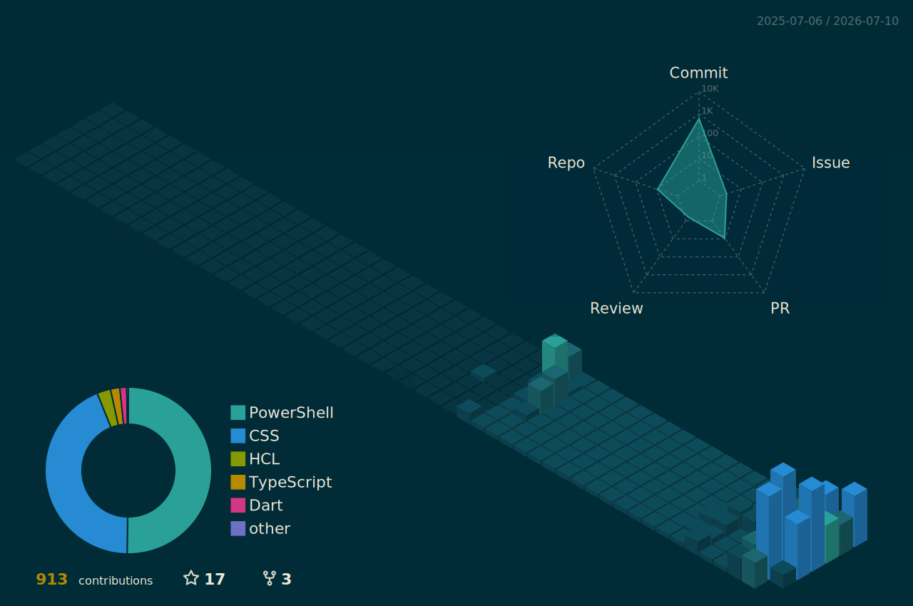

```mermaid
%%{init: {'theme':'dark', 'themeVariables': { 'primaryColor': '#0d1117', 'primaryTextColor': '#c9d1d9', 'lineColor': '#3fb950'}}}%%
graph TB
  A["🧑‍💻 Mohammad Mehrani"] --> B["⚡ GitHub Actions"]
  B --> C["🔄 3D Contribution<br/>Graphs"]
  B --> D["📊 Stats Sync"]
  B --> E["🏆 Trophy Engine"]
  C --> F["🌙 Night Rainbow<br/>(Top)"]
  C --> G["🎨 Daily Rotating<br/>Theme (Bottom)"]
  D --> H["📈 Activity Graph"]
  D --> I["📋 Summary Cards"]
  E --> J["🏅 GitHub Trophies"]
  J --> K["🥇 Rank: A+"]
```

<p align="center">
  
</p>

<p align="center">
  
  &nbsp;
  
  &nbsp;
  
  &nbsp;
  
  &nbsp;
  <a href="https://mohammadmehrani.github.io/achievements">
    
  </a>
  &nbsp;
  <a href="https://skyline3d.in/mohammadmehrani" target="_blank">
    
  </a>
</p>

```terminal
┌────────────────────────────────────────────────────────────┐
│                                                            │
│   ███╗   ███╗ ██████╗ ██╗  ██╗ █████╗ ███╗   ███╗███╗   ███╗██████╗ ███████╗██╗  ██╗██████╗  █████╗ ███╗   ██╗██╗      │
│   ████╗ ████║██╔═══██╗██║  ██║██╔══██╗████╗ ████║████╗ ████║██╔══██╗██╔════╝██║  ██║██╔══██╗██╔══██╗████╗  ██║██║      │
│   ██╔████╔██║██║   ██║███████║███████║██╔████╔██║██╔████╔██║██████╔╝█████╗  ███████║██████╔╝███████║██╔██╗ ██║██║      │
│   ██║╚██╔╝██║██║   ██║██╔══██║██╔══██║██║╚██╔╝██║██║╚██╔╝██║██╔══██╗██╔══╝  ██╔══██║██╔══██╗██╔══██║██║╚██╗██║██║      │
│   ██║ ╚═╝ ██║╚██████╔╝██║  ██║██║  ██║██║ ╚═╝ ██║██║ ╚═╝ ██║██║  ██║███████╗██║  ██║██║  ██║██║  ██║██║ ╚████║██║      │
│   ╚═╝     ╚═╝ ╚═════╝ ╚═╝  ╚═╝╚═╝  ╚═╝╚═╝     ╚═╝╚═╝     ╚═╝╚═╝  ╚═╝╚══════╝╚═╝  ╚═╝╚═╝  ╚═╝╚═╝  ╚═╝╚═╝  ╚═══╝╚═╝      │
│                                                            │
│                     DevOps Engineer & Cloud Architect      │
│                     CI/CD · Kubernetes · Infrastructure    │
│                                                            │
└────────────────────────────────────────────────────────────┘
```

```yaml
about_me:
  name: "Mohammad Mehrani"
  alias: "Maddix Mhn"
  role: "DevOps Engineer / Cloud Architect"
  location: "Iran"
  focus:
    - CI/CD Pipeline Design
    - Kubernetes Orchestration
    - Infrastructure as Code
    - Cloud Automation
    - Production-Grade Linux Environments
  certifications:
    - "[Provisioned Certificate Name]"
  philosophy: "Reliable systems through clean architecture and automation"
  currently_learning:
    - Go
    - Advanced Cloud Security
```

<p align="center">
  
</p>

<p align="center">
  
</p>

<p align="center">
  
</p>

<p align="center">
  
  &nbsp;
  
</p>

<p align="center">
  
</p>

<p align="center">
  
  &nbsp;
  
</p>

<p align="center">
  
</p>

<p align="center">
  
</p>

<details>
  <summary><b>⚡ Connect & Links</b></summary>
  <br>
  <p align="center">
    <a href="https://github.com/mohammadmehrani">
      
    </a>
    <a href="https://www.linkedin.com/in/mohammadmehrani/">
      
    </a>
    <a href="https://t.me/mohammad_mehrani">
      
    </a>
    <a href="https://iodeck.ir/">
      
    </a>
    <a href="mailto:mehrani1992@gmail.com">
      
    </a>
    <a href="https://gitlab.com/mohammadmehrani">
      
    </a>
  </p>
  <p align="center">
    
    
    <a href="https://mohammadmehrani.github.io/">
      
    </a>
    <a href="https://mohammadmehrani.vercel.app/">
      
    </a>
  </p>
</details>

<br>

```text
⚙️ Automated Workflow Pipeline

    ┌─────────────────────────────────────────────────────────┐
    │                    Mohammad Mehrani                     │
    │                   CI/CD · Automation · Cloud            │
    └──────────────────────┬──────────────────────────────────┘
                           │
           ┌───────────────┴───────────────┐
           │           GitHub              │
           │         ┌─────┴─────┐         │
           │     Webhooks    Actions       │
           └───────┬──────────────┬────────┘
                   │              │
        ┌──────────┴───┐   ┌─────┴──────┐
        │  Worker      │   │  3D SVG    │
        │  Cloudflare  │   │  Generator │
        └──────┬───────┘   └─────┬──────┘
               │                 │
         ┌─────┴─────┐     ┌────┴─────┐
         │  GitHub   │     │  README  │
         │   API     │     │  Update  │
         └─────┬─────┘     └──────────┘
               │
         ┌─────┴─────┐
         │   Stats   │
         │   Cache   │
         └───────────┘
```
