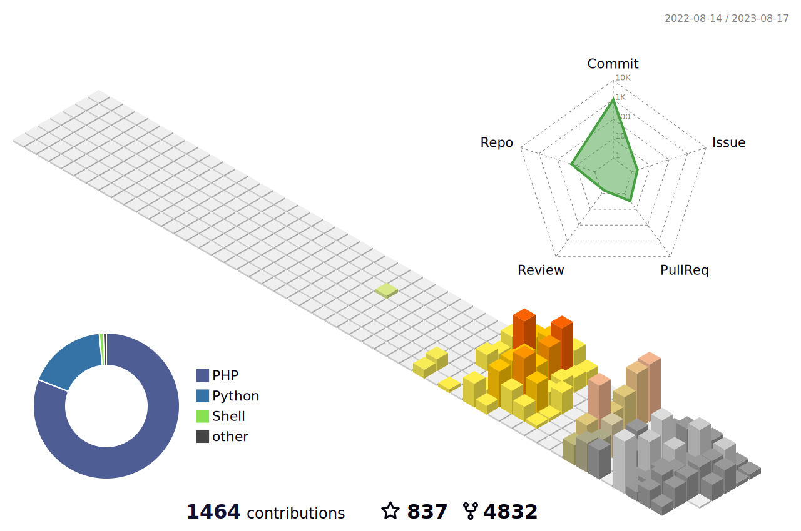

# Mohammad Mehrani

  

  
  
  
  
  
  

  
  
  

## About Me

- Backend and automation focused developer.
- Building practical systems with clean architecture.
- Interested in Python, Go, cloud tools, and DevOps workflows.

## Tech Stack

  

## Project Performance Report

  
  

  

  

  

  
  

## Contribution Views

  

#!/bin/bash
echo 'GENERATING ART...'
mkdir github_painter
cd github_painter
git init
git remote add origin https://github.com/mohammadmehrani/mohammadmehrani.git
git pull origin main
touch foobar.txt
echo 'Sun Jan 11 2026 00:00:00 GMT+0330 (Iran Standard Time) -> (0)' >> foobar.txt
git add foobar.txt
git commit --date='Sun Jan 11 2026 00:00:00 GMT+0330 (Iran Standard Time)' -m 'Sun Jan 11 2026 00:00:00 GMT+0330 (Iran Standard Time)'
echo 'Mon Jan 12 2026 00:00:00 GMT+0330 (Iran Standard Time) -> (0)' >> foobar.txt
git add foobar.txt
git commit --date='Mon Jan 12 2026 00:00:00 GMT+0330 (Iran Standard Time)' -m 'Mon Jan 12 2026 00:00:00 GMT+0330 (Iran Standard Time)'
echo 'Tue Jan 13 2026 00:00:00 GMT+0330 (Iran Standard Time) -> (0)' >> foobar.txt
git add foobar.txt
git commit --date='Tue Jan 13 2026 00:00:00 GMT+0330 (Iran Standard Time)' -m 'Tue Jan 13 2026 00:00:00 GMT+0330 (Iran Standard Time)'
echo 'Wed Jan 14 2026 00:00:00 GMT+0330 (Iran Standard Time) -> (0)' >> foobar.txt
git add foobar.txt
git commit --date='Wed Jan 14 2026 00:00:00 GMT+0330 (Iran Standard Time)' -m 'Wed Jan 14 2026 00:00:00 GMT+0330 (Iran Standard Time)'
echo 'Thu Jan 15 2026 00:00:00 GMT+0330 (Iran Standard Time) -> (0)' >> foobar.txt
git add foobar.txt
git commit --date='Thu Jan 15 2026 00:00:00 GMT+0330 (Iran Standard Time)' -m 'Thu Jan 15 2026 00:00:00 GMT+0330 (Iran Standard Time)'
echo 'Fri Jan 16 2026 00:00:00 GMT+0330 (Iran Standard Time) -> (0)' >> foobar.txt
git add foobar.txt
git commit --date='Fri Jan 16 2026 00:00:00 GMT+0330 (Iran Standard Time)' -m 'Fri Jan 16 2026 00:00:00 GMT+0330 (Iran Standard Time)'
echo 'Sat Jan 17 2026 00:00:00 GMT+0330 (Iran Standard Time) -> (0)' >> foobar.txt
git add foobar.txt
git commit --date='Sat Jan 17 2026 00:00:00 GMT+0330 (Iran Standard Time)' -m 'Sat Jan 17 2026 00:00:00 GMT+0330 (Iran Standard Time)'
echo 'Mon Jan 19 2026 00:00:00 GMT+0330 (Iran Standard Time) -> (0)' >> foobar.txt
git add foobar.txt
git commit --date='Mon Jan 19 2026 00:00:00 GMT+0330 (Iran Standard Time)' -m 'Mon Jan 19 2026 00:00:00 GMT+0330 (Iran Standard Time)'
echo 'Tue Jan 27 2026 00:00:00 GMT+0330 (Iran Standard Time) -> (0)' >> foobar.txt
git add foobar.txt
git commit --date='Tue Jan 27 2026 00:00:00 GMT+0330 (Iran Standard Time)' -m 'Tue Jan 27 2026 00:00:00 GMT+0330 (Iran Standard Time)'
echo 'Tue Jan 27 2026 00:00:00 GMT+0330 (Iran Standard Time) -> (1)' >> foobar.txt
git add foobar.txt
git commit --date='Tue Jan 27 2026 00:00:00 GMT+0330 (Iran Standard Time)' -m 'Tue Jan 27 2026 00:00:00 GMT+0330 (Iran Standard Time)'
echo 'Mon Feb 02 2026 00:00:00 GMT+0330 (Iran Standard Time) -> (0)' >> foobar.txt
git add foobar.txt
git commit --date='Mon Feb 02 2026 00:00:00 GMT+0330 (Iran Standard Time)' -m 'Mon Feb 02 2026 00:00:00 GMT+0330 (Iran Standard Time)'
echo 'Mon Feb 02 2026 00:00:00 GMT+0330 (Iran Standard Time) -> (1)' >> foobar.txt
git add foobar.txt
git commit --date='Mon Feb 02 2026 00:00:00 GMT+0330 (Iran Standard Time)' -m 'Mon Feb 02 2026 00:00:00 GMT+0330 (Iran Standard Time)'
echo 'Mon Feb 02 2026 00:00:00 GMT+0330 (Iran Standard Time) -> (2)' >> foobar.txt
git add foobar.txt
git commit --date='Mon Feb 02 2026 00:00:00 GMT+0330 (Iran Standard Time)' -m 'Mon Feb 02 2026 00:00:00 GMT+0330 (Iran Standard Time)'
echo 'Sun Feb 08 2026 00:00:00 GMT+0330 (Iran Standard Time) -> (0)' >> foobar.txt
git add foobar.txt
git commit --date='Sun Feb 08 2026 00:00:00 GMT+0330 (Iran Standard Time)' -m 'Sun Feb 08 2026 00:00:00 GMT+0330 (Iran Standard Time)'
echo 'Sun Feb 08 2026 00:00:00 GMT+0330 (Iran Standard Time) -> (1)' >> foobar.txt
git add foobar.txt
git commit --date='Sun Feb 08 2026 00:00:00 GMT+0330 (Iran Standard Time)' -m 'Sun Feb 08 2026 00:00:00 GMT+0330 (Iran Standard Time)'
echo 'Sun Feb 08 2026 00:00:00 GMT+0330 (Iran Standard Time) -> (2)' >> foobar.txt
git add foobar.txt
git commit --date='Sun Feb 08 2026 00:00:00 GMT+0330 (Iran Standard Time)' -m 'Sun Feb 08 2026 00:00:00 GMT+0330 (Iran Standard Time)'
echo 'Sun Feb 08 2026 00:00:00 GMT+0330 (Iran Standard Time) -> (3)' >> foobar.txt
git add foobar.txt
git commit --date='Sun Feb 08 2026 00:00:00 GMT+0330 (Iran Standard Time)' -m 'Sun Feb 08 2026 00:00:00 GMT+0330 (Iran Standard Time)'
echo 'Mon Feb 09 2026 00:00:00 GMT+0330 (Iran Standard Time) -> (0)' >> foobar.txt
git add foobar.txt
git commit --date='Mon Feb 09 2026 00:00:00 GMT+0330 (Iran Standard Time)' -m 'Mon Feb 09 2026 00:00:00 GMT+0330 (Iran Standard Time)'
echo 'Mon Feb 09 2026 00:00:00 GMT+0330 (Iran Standard Time) -> (1)' >> foobar.txt
git add foobar.txt
git commit --date='Mon Feb 09 2026 00:00:00 GMT+0330 (Iran Standard Time)' -m 'Mon Feb 09 2026 00:00:00 GMT+0330 (Iran Standard Time)'
echo 'Mon Feb 09 2026 00:00:00 GMT+0330 (Iran Standard Time) -> (2)' >> foobar.txt
git add foobar.txt
git commit --date='Mon Feb 09 2026 00:00:00 GMT+0330 (Iran Standard Time)' -m 'Mon Feb 09 2026 00:00:00 GMT+0330 (Iran Standard Time)'
echo 'Mon Feb 09 2026 00:00:00 GMT+0330 (Iran Standard Time) -> (3)' >> foobar.txt
git add foobar.txt
git commit --date='Mon Feb 09 2026 00:00:00 GMT+0330 (Iran Standard Time)' -m 'Mon Feb 09 2026 00:00:00 GMT+0330 (Iran Standard Time)'
echo 'Tue Feb 10 2026 00:00:00 GMT+0330 (Iran Standard Time) -> (0)' >> foobar.txt
git add foobar.txt
git commit --date='Tue Feb 10 2026 00:00:00 GMT+0330 (Iran Standard Time)' -m 'Tue Feb 10 2026 00:00:00 GMT+0330 (Iran Standard Time)'
echo 'Tue Feb 10 2026 00:00:00 GMT+0330 (Iran Standard Time) -> (1)' >> foobar.txt
git add foobar.txt
git commit --date='Tue Feb 10 2026 00:00:00 GMT+0330 (Iran Standard Time)' -m 'Tue Feb 10 2026 00:00:00 GMT+0330 (Iran Standard Time)'
echo 'Tue Feb 10 2026 00:00:00 GMT+0330 (Iran Standard Time) -> (2)' >> foobar.txt
git add foobar.txt
git commit --date='Tue Feb 10 2026 00:00:00 GMT+0330 (Iran Standard Time)' -m 'Tue Feb 10 2026 00:00:00 GMT+0330 (Iran Standard Time)'
echo 'Tue Feb 10 2026 00:00:00 GMT+0330 (Iran Standard Time) -> (3)' >> foobar.txt
git add foobar.txt
git commit --date='Tue Feb 10 2026 00:00:00 GMT+0330 (Iran Standard Time)' -m 'Tue Feb 10 2026 00:00:00 GMT+0330 (Iran Standard Time)'
echo 'Wed Feb 11 2026 00:00:00 GMT+0330 (Iran Standard Time) -> (0)' >> foobar.txt
git add foobar.txt
git commit --date='Wed Feb 11 2026 00:00:00 GMT+0330 (Iran Standard Time)' -m 'Wed Feb 11 2026 00:00:00 GMT+0330 (Iran Standard Time)'
echo 'Wed Feb 11 2026 00:00:00 GMT+0330 (Iran Standard Time) -> (1)' >> foobar.txt
git add foobar.txt
git commit --date='Wed Feb 11 2026 00:00:00 GMT+0330 (Iran Standard Time)' -m 'Wed Feb 11 2026 00:00:00 GMT+0330 (Iran Standard Time)'
echo 'Wed Feb 11 2026 00:00:00 GMT+0330 (Iran Standard Time) -> (2)' >> foobar.txt
git add foobar.txt
git commit --date='Wed Feb 11 2026 00:00:00 GMT+0330 (Iran Standard Time)' -m 'Wed Feb 11 2026 00:00:00 GMT+0330 (Iran Standard Time)'
echo 'Wed Feb 11 2026 00:00:00 GMT+0330 (Iran Standard Time) -> (3)' >> foobar.txt
git add foobar.txt
git commit --date='Wed Feb 11 2026 00:00:00 GMT+0330 (Iran Standard Time)' -m 'Wed Feb 11 2026 00:00:00 GMT+0330 (Iran Standard Time)'
echo 'Thu Feb 12 2026 00:00:00 GMT+0330 (Iran Standard Time) -> (0)' >> foobar.txt
git add foobar.txt
git commit --date='Thu Feb 12 2026 00:00:00 GMT+0330 (Iran Standard Time)' -m 'Thu Feb 12 2026 00:00:00 GMT+0330 (Iran Standard Time)'
echo 'Thu Feb 12 2026 00:00:00 GMT+0330 (Iran Standard Time) -> (1)' >> foobar.txt
git add foobar.txt
git commit --date='Thu Feb 12 2026 00:00:00 GMT+0330 (Iran Standard Time)' -m 'Thu Feb 12 2026 00:00:00 GMT+0330 (Iran Standard Time)'
echo 'Thu Feb 12 2026 00:00:00 GMT+0330 (Iran Standard Time) -> (2)' >> foobar.txt
git add foobar.txt
git commit --date='Thu Feb 12 2026 00:00:00 GMT+0330 (Iran Standard Time)' -m 'Thu Feb 12 2026 00:00:00 GMT+0330 (Iran Standard Time)'
echo 'Thu Feb 12 2026 00:00:00 GMT+0330 (Iran Standard Time) -> (3)' >> foobar.txt
git add foobar.txt
git commit --date='Thu Feb 12 2026 00:00:00 GMT+0330 (Iran Standard Time)' -m 'Thu Feb 12 2026 00:00:00 GMT+0330 (Iran Standard Time)'
echo 'Fri Feb 13 2026 00:00:00 GMT+0330 (Iran Standard Time) -> (0)' >> foobar.txt
git add foobar.txt
git commit --date='Fri Feb 13 2026 00:00:00 GMT+0330 (Iran Standard Time)' -m 'Fri Feb 13 2026 00:00:00 GMT+0330 (Iran Standard Time)'
echo 'Fri Feb 13 2026 00:00:00 GMT+0330 (Iran Standard Time) -> (1)' >> foobar.txt
git add foobar.txt
git commit --date='Fri Feb 13 2026 00:00:00 GMT+0330 (Iran Standard Time)' -m 'Fri Feb 13 2026 00:00:00 GMT+0330 (Iran Standard Time)'
echo 'Fri Feb 13 2026 00:00:00 GMT+0330 (Iran Standard Time) -> (2)' >> foobar.txt
git add foobar.txt
git commit --date='Fri Feb 13 2026 00:00:00 GMT+0330 (Iran Standard Time)' -m 'Fri Feb 13 2026 00:00:00 GMT+0330 (Iran Standard Time)'
echo 'Fri Feb 13 2026 00:00:00 GMT+0330 (Iran Standard Time) -> (3)' >> foobar.txt
git add foobar.txt
git commit --date='Fri Feb 13 2026 00:00:00 GMT+0330 (Iran Standard Time)' -m 'Fri Feb 13 2026 00:00:00 GMT+0330 (Iran Standard Time)'
echo 'Sat Feb 14 2026 00:00:00 GMT+0330 (Iran Standard Time) -> (0)' >> foobar.txt
git add foobar.txt
git commit --date='Sat Feb 14 2026 00:00:00 GMT+0330 (Iran Standard Time)' -m 'Sat Feb 14 2026 00:00:00 GMT+0330 (Iran Standard Time)'
echo 'Sat Feb 14 2026 00:00:00 GMT+0330 (Iran Standard Time) -> (1)' >> foobar.txt
git add foobar.txt
git commit --date='Sat Feb 14 2026 00:00:00 GMT+0330 (Iran Standard Time)' -m 'Sat Feb 14 2026 00:00:00 GMT+0330 (Iran Standard Time)'
echo 'Sat Feb 14 2026 00:00:00 GMT+0330 (Iran Standard Time) -> (2)' >> foobar.txt
git add foobar.txt
git commit --date='Sat Feb 14 2026 00:00:00 GMT+0330 (Iran Standard Time)' -m 'Sat Feb 14 2026 00:00:00 GMT+0330 (Iran Standard Time)'
echo 'Sat Feb 14 2026 00:00:00 GMT+0330 (Iran Standard Time) -> (3)' >> foobar.txt
git add foobar.txt
git commit --date='Sat Feb 14 2026 00:00:00 GMT+0330 (Iran Standard Time)' -m 'Sat Feb 14 2026 00:00:00 GMT+0330 (Iran Standard Time)'
echo 'Mon Feb 23 2026 00:00:00 GMT+0330 (Iran Standard Time) -> (0)' >> foobar.txt
git add foobar.txt
git commit --date='Mon Feb 23 2026 00:00:00 GMT+0330 (Iran Standard Time)' -m 'Mon Feb 23 2026 00:00:00 GMT+0330 (Iran Standard Time)'
echo 'Tue Feb 24 2026 00:00:00 GMT+0330 (Iran Standard Time) -> (0)' >> foobar.txt
git add foobar.txt
git commit --date='Tue Feb 24 2026 00:00:00 GMT+0330 (Iran Standard Time)' -m 'Tue Feb 24 2026 00:00:00 GMT+0330 (Iran Standard Time)'
echo 'Wed Feb 25 2026 00:00:00 GMT+0330 (Iran Standard Time) -> (0)' >> foobar.txt
git add foobar.txt
git commit --date='Wed Feb 25 2026 00:00:00 GMT+0330 (Iran Standard Time)' -m 'Wed Feb 25 2026 00:00:00 GMT+0330 (Iran Standard Time)'
echo 'Thu Feb 26 2026 00:00:00 GMT+0330 (Iran Standard Time) -> (0)' >> foobar.txt
git add foobar.txt
git commit --date='Thu Feb 26 2026 00:00:00 GMT+0330 (Iran Standard Time)' -m 'Thu Feb 26 2026 00:00:00 GMT+0330 (Iran Standard Time)'
echo 'Fri Feb 27 2026 00:00:00 GMT+0330 (Iran Standard Time) -> (0)' >> foobar.txt
git add foobar.txt
git commit --date='Fri Feb 27 2026 00:00:00 GMT+0330 (Iran Standard Time)' -m 'Fri Feb 27 2026 00:00:00 GMT+0330 (Iran Standard Time)'
echo 'Sun Mar 01 2026 00:00:00 GMT+0330 (Iran Standard Time) -> (0)' >> foobar.txt
git add foobar.txt
git commit --date='Sun Mar 01 2026 00:00:00 GMT+0330 (Iran Standard Time)' -m 'Sun Mar 01 2026 00:00:00 GMT+0330 (Iran Standard Time)'
echo 'Sat Mar 07 2026 00:00:00 GMT+0330 (Iran Standard Time) -> (0)' >> foobar.txt
git add foobar.txt
git commit --date='Sat Mar 07 2026 00:00:00 GMT+0330 (Iran Standard Time)' -m 'Sat Mar 07 2026 00:00:00 GMT+0330 (Iran Standard Time)'
echo 'Sun Mar 08 2026 00:00:00 GMT+0330 (Iran Standard Time) -> (0)' >> foobar.txt
git add foobar.txt
git commit --date='Sun Mar 08 2026 00:00:00 GMT+0330 (Iran Standard Time)' -m 'Sun Mar 08 2026 00:00:00 GMT+0330 (Iran Standard Time)'
echo 'Sun Mar 08 2026 00:00:00 GMT+0330 (Iran Standard Time) -> (1)' >> foobar.txt
git add foobar.txt
git commit --date='Sun Mar 08 2026 00:00:00 GMT+0330 (Iran Standard Time)' -m 'Sun Mar 08 2026 00:00:00 GMT+0330 (Iran Standard Time)'
echo 'Sat Mar 14 2026 00:00:00 GMT+0330 (Iran Standard Time) -> (0)' >> foobar.txt
git add foobar.txt
git commit --date='Sat Mar 14 2026 00:00:00 GMT+0330 (Iran Standard Time)' -m 'Sat Mar 14 2026 00:00:00 GMT+0330 (Iran Standard Time)'
echo 'Sat Mar 14 2026 00:00:00 GMT+0330 (Iran Standard Time) -> (1)' >> foobar.txt
git add foobar.txt
git commit --date='Sat Mar 14 2026 00:00:00 GMT+0330 (Iran Standard Time)' -m 'Sat Mar 14 2026 00:00:00 GMT+0330 (Iran Standard Time)'
echo 'Sun Mar 15 2026 00:00:00 GMT+0330 (Iran Standard Time) -> (0)' >> foobar.txt
git add foobar.txt
git commit --date='Sun Mar 15 2026 00:00:00 GMT+0330 (Iran Standard Time)' -m 'Sun Mar 15 2026 00:00:00 GMT+0330 (Iran Standard Time)'
echo 'Sun Mar 15 2026 00:00:00 GMT+0330 (Iran Standard Time) -> (1)' >> foobar.txt
git add foobar.txt
git commit --date='Sun Mar 15 2026 00:00:00 GMT+0330 (Iran Standard Time)' -m 'Sun Mar 15 2026 00:00:00 GMT+0330 (Iran Standard Time)'
echo 'Sun Mar 15 2026 00:00:00 GMT+0330 (Iran Standard Time) -> (2)' >> foobar.txt
git add foobar.txt
git commit --date='Sun Mar 15 2026 00:00:00 GMT+0330 (Iran Standard Time)' -m 'Sun Mar 15 2026 00:00:00 GMT+0330 (Iran Standard Time)'
echo 'Sat Mar 21 2026 00:00:00 GMT+0330 (Iran Standard Time) -> (0)' >> foobar.txt
git add foobar.txt
git commit --date='Sat Mar 21 2026 00:00:00 GMT+0330 (Iran Standard Time)' -m 'Sat Mar 21 2026 00:00:00 GMT+0330 (Iran Standard Time)'
echo 'Sat Mar 21 2026 00:00:00 GMT+0330 (Iran Standard Time) -> (1)' >> foobar.txt
git add foobar.txt
git commit --date='Sat Mar 21 2026 00:00:00 GMT+0330 (Iran Standard Time)' -m 'Sat Mar 21 2026 00:00:00 GMT+0330 (Iran Standard Time)'
echo 'Sat Mar 21 2026 00:00:00 GMT+0330 (Iran Standard Time) -> (2)' >> foobar.txt
git add foobar.txt
git commit --date='Sat Mar 21 2026 00:00:00 GMT+0330 (Iran Standard Time)' -m 'Sat Mar 21 2026 00:00:00 GMT+0330 (Iran Standard Time)'
echo 'Mon Mar 23 2026 00:00:00 GMT+0330 (Iran Standard Time) -> (0)' >> foobar.txt
git add foobar.txt
git commit --date='Mon Mar 23 2026 00:00:00 GMT+0330 (Iran Standard Time)' -m 'Mon Mar 23 2026 00:00:00 GMT+0330 (Iran Standard Time)'
echo 'Mon Mar 23 2026 00:00:00 GMT+0330 (Iran Standard Time) -> (1)' >> foobar.txt
git add foobar.txt
git commit --date='Mon Mar 23 2026 00:00:00 GMT+0330 (Iran Standard Time)' -m 'Mon Mar 23 2026 00:00:00 GMT+0330 (Iran Standard Time)'
echo 'Mon Mar 23 2026 00:00:00 GMT+0330 (Iran Standard Time) -> (2)' >> foobar.txt
git add foobar.txt
git commit --date='Mon Mar 23 2026 00:00:00 GMT+0330 (Iran Standard Time)' -m 'Mon Mar 23 2026 00:00:00 GMT+0330 (Iran Standard Time)'
echo 'Mon Mar 23 2026 00:00:00 GMT+0330 (Iran Standard Time) -> (3)' >> foobar.txt
git add foobar.txt
git commit --date='Mon Mar 23 2026 00:00:00 GMT+0330 (Iran Standard Time)' -m 'Mon Mar 23 2026 00:00:00 GMT+0330 (Iran Standard Time)'
echo 'Tue Mar 24 2026 00:00:00 GMT+0330 (Iran Standard Time) -> (0)' >> foobar.txt
git add foobar.txt
git commit --date='Tue Mar 24 2026 00:00:00 GMT+0330 (Iran Standard Time)' -m 'Tue Mar 24 2026 00:00:00 GMT+0330 (Iran Standard Time)'
echo 'Tue Mar 24 2026 00:00:00 GMT+0330 (Iran Standard Time) -> (1)' >> foobar.txt
git add foobar.txt
git commit --date='Tue Mar 24 2026 00:00:00 GMT+0330 (Iran Standard Time)' -m 'Tue Mar 24 2026 00:00:00 GMT+0330 (Iran Standard Time)'
echo 'Tue Mar 24 2026 00:00:00 GMT+0330 (Iran Standard Time) -> (2)' >> foobar.txt
git add foobar.txt
git commit --date='Tue Mar 24 2026 00:00:00 GMT+0330 (Iran Standard Time)' -m 'Tue Mar 24 2026 00:00:00 GMT+0330 (Iran Standard Time)'
echo 'Tue Mar 24 2026 00:00:00 GMT+0330 (Iran Standard Time) -> (3)' >> foobar.txt
git add foobar.txt
git commit --date='Tue Mar 24 2026 00:00:00 GMT+0330 (Iran Standard Time)' -m 'Tue Mar 24 2026 00:00:00 GMT+0330 (Iran Standard Time)'
echo 'Wed Mar 25 2026 00:00:00 GMT+0330 (Iran Standard Time) -> (0)' >> foobar.txt
git add foobar.txt
git commit --date='Wed Mar 25 2026 00:00:00 GMT+0330 (Iran Standard Time)' -m 'Wed Mar 25 2026 00:00:00 GMT+0330 (Iran Standard Time)'
echo 'Wed Mar 25 2026 00:00:00 GMT+0330 (Iran Standard Time) -> (1)' >> foobar.txt
git add foobar.txt
git commit --date='Wed Mar 25 2026 00:00:00 GMT+0330 (Iran Standard Time)' -m 'Wed Mar 25 2026 00:00:00 GMT+0330 (Iran Standard Time)'
echo 'Wed Mar 25 2026 00:00:00 GMT+0330 (Iran Standard Time) -> (2)' >> foobar.txt
git add foobar.txt
git commit --date='Wed Mar 25 2026 00:00:00 GMT+0330 (Iran Standard Time)' -m 'Wed Mar 25 2026 00:00:00 GMT+0330 (Iran Standard Time)'
echo 'Wed Mar 25 2026 00:00:00 GMT+0330 (Iran Standard Time) -> (3)' >> foobar.txt
git add foobar.txt
git commit --date='Wed Mar 25 2026 00:00:00 GMT+0330 (Iran Standard Time)' -m 'Wed Mar 25 2026 00:00:00 GMT+0330 (Iran Standard Time)'
echo 'Thu Mar 26 2026 00:00:00 GMT+0330 (Iran Standard Time) -> (0)' >> foobar.txt
git add foobar.txt
git commit --date='Thu Mar 26 2026 00:00:00 GMT+0330 (Iran Standard Time)' -m 'Thu Mar 26 2026 00:00:00 GMT+0330 (Iran Standard Time)'
echo 'Thu Mar 26 2026 00:00:00 GMT+0330 (Iran Standard Time) -> (1)' >> foobar.txt
git add foobar.txt
git commit --date='Thu Mar 26 2026 00:00:00 GMT+0330 (Iran Standard Time)' -m 'Thu Mar 26 2026 00:00:00 GMT+0330 (Iran Standard Time)'
echo 'Thu Mar 26 2026 00:00:00 GMT+0330 (Iran Standard Time) -> (2)' >> foobar.txt
git add foobar.txt
git commit --date='Thu Mar 26 2026 00:00:00 GMT+0330 (Iran Standard Time)' -m 'Thu Mar 26 2026 00:00:00 GMT+0330 (Iran Standard Time)'
echo 'Thu Mar 26 2026 00:00:00 GMT+0330 (Iran Standard Time) -> (3)' >> foobar.txt
git add foobar.txt
git commit --date='Thu Mar 26 2026 00:00:00 GMT+0330 (Iran Standard Time)' -m 'Thu Mar 26 2026 00:00:00 GMT+0330 (Iran Standard Time)'
echo 'Fri Mar 27 2026 00:00:00 GMT+0330 (Iran Standard Time) -> (0)' >> foobar.txt
git add foobar.txt
git commit --date='Fri Mar 27 2026 00:00:00 GMT+0330 (Iran Standard Time)' -m 'Fri Mar 27 2026 00:00:00 GMT+0330 (Iran Standard Time)'
echo 'Fri Mar 27 2026 00:00:00 GMT+0330 (Iran Standard Time) -> (1)' >> foobar.txt
git add foobar.txt
git commit --date='Fri Mar 27 2026 00:00:00 GMT+0330 (Iran Standard Time)' -m 'Fri Mar 27 2026 00:00:00 GMT+0330 (Iran Standard Time)'
echo 'Fri Mar 27 2026 00:00:00 GMT+0330 (Iran Standard Time) -> (2)' >> foobar.txt
git add foobar.txt
git commit --date='Fri Mar 27 2026 00:00:00 GMT+0330 (Iran Standard Time)' -m 'Fri Mar 27 2026 00:00:00 GMT+0330 (Iran Standard Time)'
echo 'Fri Mar 27 2026 00:00:00 GMT+0330 (Iran Standard Time) -> (3)' >> foobar.txt
git add foobar.txt
git commit --date='Fri Mar 27 2026 00:00:00 GMT+0330 (Iran Standard Time)' -m 'Fri Mar 27 2026 00:00:00 GMT+0330 (Iran Standard Time)'
echo 'Sun Apr 05 2026 00:00:00 GMT+0330 (Iran Standard Time) -> (0)' >> foobar.txt
git add foobar.txt
git commit --date='Sun Apr 05 2026 00:00:00 GMT+0330 (Iran Standard Time)' -m 'Sun Apr 05 2026 00:00:00 GMT+0330 (Iran Standard Time)'
echo 'Mon Apr 06 2026 00:00:00 GMT+0330 (Iran Standard Time) -> (0)' >> foobar.txt
git add foobar.txt
git commit --date='Mon Apr 06 2026 00:00:00 GMT+0330 (Iran Standard Time)' -m 'Mon Apr 06 2026 00:00:00 GMT+0330 (Iran Standard Time)'
echo 'Tue Apr 07 2026 00:00:00 GMT+0330 (Iran Standard Time) -> (0)' >> foobar.txt
git add foobar.txt
git commit --date='Tue Apr 07 2026 00:00:00 GMT+0330 (Iran Standard Time)' -m 'Tue Apr 07 2026 00:00:00 GMT+0330 (Iran Standard Time)'
echo 'Wed Apr 08 2026 00:00:00 GMT+0330 (Iran Standard Time) -> (0)' >> foobar.txt
git add foobar.txt
git commit --date='Wed Apr 08 2026 00:00:00 GMT+0330 (Iran Standard Time)' -m 'Wed Apr 08 2026 00:00:00 GMT+0330 (Iran Standard Time)'
echo 'Thu Apr 09 2026 00:00:00 GMT+0330 (Iran Standard Time) -> (0)' >> foobar.txt
git add foobar.txt
git commit --date='Thu Apr 09 2026 00:00:00 GMT+0330 (Iran Standard Time)' -m 'Thu Apr 09 2026 00:00:00 GMT+0330 (Iran Standard Time)'
echo 'Fri Apr 10 2026 00:00:00 GMT+0330 (Iran Standard Time) -> (0)' >> foobar.txt
git add foobar.txt
git commit --date='Fri Apr 10 2026 00:00:00 GMT+0330 (Iran Standard Time)' -m 'Fri Apr 10 2026 00:00:00 GMT+0330 (Iran Standard Time)'
echo 'Sat Apr 11 2026 00:00:00 GMT+0330 (Iran Standard Time) -> (0)' >> foobar.txt
git add foobar.txt
git commit --date='Sat Apr 11 2026 00:00:00 GMT+0330 (Iran Standard Time)' -m 'Sat Apr 11 2026 00:00:00 GMT+0330 (Iran Standard Time)'
echo 'Wed Apr 15 2026 00:00:00 GMT+0330 (Iran Standard Time) -> (0)' >> foobar.txt
git add foobar.txt
git commit --date='Wed Apr 15 2026 00:00:00 GMT+0330 (Iran Standard Time)' -m 'Wed Apr 15 2026 00:00:00 GMT+0330 (Iran Standard Time)'
echo 'Wed Apr 22 2026 00:00:00 GMT+0330 (Iran Standard Time) -> (0)' >> foobar.txt
git add foobar.txt
git commit --date='Wed Apr 22 2026 00:00:00 GMT+0330 (Iran Standard Time)' -m 'Wed Apr 22 2026 00:00:00 GMT+0330 (Iran Standard Time)'
echo 'Wed Apr 22 2026 00:00:00 GMT+0330 (Iran Standard Time) -> (1)' >> foobar.txt
git add foobar.txt
git commit --date='Wed Apr 22 2026 00:00:00 GMT+0330 (Iran Standard Time)' -m 'Wed Apr 22 2026 00:00:00 GMT+0330 (Iran Standard Time)'
echo 'Sun Apr 26 2026 00:00:00 GMT+0330 (Iran Standard Time) -> (0)' >> foobar.txt
git add foobar.txt
git commit --date='Sun Apr 26 2026 00:00:00 GMT+0330 (Iran Standard Time)' -m 'Sun Apr 26 2026 00:00:00 GMT+0330 (Iran Standard Time)'
echo 'Sun Apr 26 2026 00:00:00 GMT+0330 (Iran Standard Time) -> (1)' >> foobar.txt
git add foobar.txt
git commit --date='Sun Apr 26 2026 00:00:00 GMT+0330 (Iran Standard Time)' -m 'Sun Apr 26 2026 00:00:00 GMT+0330 (Iran Standard Time)'
echo 'Sun Apr 26 2026 00:00:00 GMT+0330 (Iran Standard Time) -> (2)' >> foobar.txt
git add foobar.txt
git commit --date='Sun Apr 26 2026 00:00:00 GMT+0330 (Iran Standard Time)' -m 'Sun Apr 26 2026 00:00:00 GMT+0330 (Iran Standard Time)'
echo 'Sun Apr 26 2026 00:00:00 GMT+0330 (Iran Standard Time) -> (3)' >> foobar.txt
git add foobar.txt
git commit --date='Sun Apr 26 2026 00:00:00 GMT+0330 (Iran Standard Time)' -m 'Sun Apr 26 2026 00:00:00 GMT+0330 (Iran Standard Time)'
echo 'Mon Apr 27 2026 00:00:00 GMT+0330 (Iran Standard Time) -> (0)' >> foobar.txt
git add foobar.txt
git commit --date='Mon Apr 27 2026 00:00:00 GMT+0330 (Iran Standard Time)' -m 'Mon Apr 27 2026 00:00:00 GMT+0330 (Iran Standard Time)'
echo 'Mon Apr 27 2026 00:00:00 GMT+0330 (Iran Standard Time) -> (1)' >> foobar.txt
git add foobar.txt
git commit --date='Mon Apr 27 2026 00:00:00 GMT+0330 (Iran Standard Time)' -m 'Mon Apr 27 2026 00:00:00 GMT+0330 (Iran Standard Time)'
echo 'Mon Apr 27 2026 00:00:00 GMT+0330 (Iran Standard Time) -> (2)' >> foobar.txt
git add foobar.txt
git commit --date='Mon Apr 27 2026 00:00:00 GMT+0330 (Iran Standard Time)' -m 'Mon Apr 27 2026 00:00:00 GMT+0330 (Iran Standard Time)'
echo 'Mon Apr 27 2026 00:00:00 GMT+0330 (Iran Standard Time) -> (3)' >> foobar.txt
git add foobar.txt
git commit --date='Mon Apr 27 2026 00:00:00 GMT+0330 (Iran Standard Time)' -m 'Mon Apr 27 2026 00:00:00 GMT+0330 (Iran Standard Time)'
echo 'Tue Apr 28 2026 00:00:00 GMT+0330 (Iran Standard Time) -> (0)' >> foobar.txt
git add foobar.txt
git commit --date='Tue Apr 28 2026 00:00:00 GMT+0330 (Iran Standard Time)' -m 'Tue Apr 28 2026 00:00:00 GMT+0330 (Iran Standard Time)'
echo 'Tue Apr 28 2026 00:00:00 GMT+0330 (Iran Standard Time) -> (1)' >> foobar.txt
git add foobar.txt
git commit --date='Tue Apr 28 2026 00:00:00 GMT+0330 (Iran Standard Time)' -m 'Tue Apr 28 2026 00:00:00 GMT+0330 (Iran Standard Time)'
echo 'Tue Apr 28 2026 00:00:00 GMT+0330 (Iran Standard Time) -> (2)' >> foobar.txt
git add foobar.txt
git commit --date='Tue Apr 28 2026 00:00:00 GMT+0330 (Iran Standard Time)' -m 'Tue Apr 28 2026 00:00:00 GMT+0330 (Iran Standard Time)'
echo 'Tue Apr 28 2026 00:00:00 GMT+0330 (Iran Standard Time) -> (3)' >> foobar.txt
git add foobar.txt
git commit --date='Tue Apr 28 2026 00:00:00 GMT+0330 (Iran Standard Time)' -m 'Tue Apr 28 2026 00:00:00 GMT+0330 (Iran Standard Time)'
echo 'Wed Apr 29 2026 00:00:00 GMT+0330 (Iran Standard Time) -> (0)' >> foobar.txt
git add foobar.txt
git commit --date='Wed Apr 29 2026 00:00:00 GMT+0330 (Iran Standard Time)' -m 'Wed Apr 29 2026 00:00:00 GMT+0330 (Iran Standard Time)'
echo 'Wed Apr 29 2026 00:00:00 GMT+0330 (Iran Standard Time) -> (1)' >> foobar.txt
git add foobar.txt
git commit --date='Wed Apr 29 2026 00:00:00 GMT+0330 (Iran Standard Time)' -m 'Wed Apr 29 2026 00:00:00 GMT+0330 (Iran Standard Time)'
echo 'Wed Apr 29 2026 00:00:00 GMT+0330 (Iran Standard Time) -> (2)' >> foobar.txt
git add foobar.txt
git commit --date='Wed Apr 29 2026 00:00:00 GMT+0330 (Iran Standard Time)' -m 'Wed Apr 29 2026 00:00:00 GMT+0330 (Iran Standard Time)'
echo 'Wed Apr 29 2026 00:00:00 GMT+0330 (Iran Standard Time) -> (3)' >> foobar.txt
git add foobar.txt
git commit --date='Wed Apr 29 2026 00:00:00 GMT+0330 (Iran Standard Time)' -m 'Wed Apr 29 2026 00:00:00 GMT+0330 (Iran Standard Time)'
echo 'Thu Apr 30 2026 00:00:00 GMT+0330 (Iran Standard Time) -> (0)' >> foobar.txt
git add foobar.txt
git commit --date='Thu Apr 30 2026 00:00:00 GMT+0330 (Iran Standard Time)' -m 'Thu Apr 30 2026 00:00:00 GMT+0330 (Iran Standard Time)'
echo 'Thu Apr 30 2026 00:00:00 GMT+0330 (Iran Standard Time) -> (1)' >> foobar.txt
git add foobar.txt
git commit --date='Thu Apr 30 2026 00:00:00 GMT+0330 (Iran Standard Time)' -m 'Thu Apr 30 2026 00:00:00 GMT+0330 (Iran Standard Time)'
echo 'Thu Apr 30 2026 00:00:00 GMT+0330 (Iran Standard Time) -> (2)' >> foobar.txt
git add foobar.txt
git commit --date='Thu Apr 30 2026 00:00:00 GMT+0330 (Iran Standard Time)' -m 'Thu Apr 30 2026 00:00:00 GMT+0330 (Iran Standard Time)'
echo 'Thu Apr 30 2026 00:00:00 GMT+0330 (Iran Standard Time) -> (3)' >> foobar.txt
git add foobar.txt
git commit --date='Thu Apr 30 2026 00:00:00 GMT+0330 (Iran Standard Time)' -m 'Thu Apr 30 2026 00:00:00 GMT+0330 (Iran Standard Time)'
echo 'Fri May 01 2026 00:00:00 GMT+0330 (Iran Standard Time) -> (0)' >> foobar.txt
git add foobar.txt
git commit --date='Fri May 01 2026 00:00:00 GMT+0330 (Iran Standard Time)' -m 'Fri May 01 2026 00:00:00 GMT+0330 (Iran Standard Time)'
echo 'Fri May 01 2026 00:00:00 GMT+0330 (Iran Standard Time) -> (1)' >> foobar.txt
git add foobar.txt
git commit --date='Fri May 01 2026 00:00:00 GMT+0330 (Iran Standard Time)' -m 'Fri May 01 2026 00:00:00 GMT+0330 (Iran Standard Time)'
echo 'Fri May 01 2026 00:00:00 GMT+0330 (Iran Standard Time) -> (2)' >> foobar.txt
git add foobar.txt
git commit --date='Fri May 01 2026 00:00:00 GMT+0330 (Iran Standard Time)' -m 'Fri May 01 2026 00:00:00 GMT+0330 (Iran Standard Time)'
echo 'Fri May 01 2026 00:00:00 GMT+0330 (Iran Standard Time) -> (3)' >> foobar.txt
git add foobar.txt
git commit --date='Fri May 01 2026 00:00:00 GMT+0330 (Iran Standard Time)' -m 'Fri May 01 2026 00:00:00 GMT+0330 (Iran Standard Time)'
echo 'Sat May 02 2026 00:00:00 GMT+0330 (Iran Standard Time) -> (0)' >> foobar.txt
git add foobar.txt
git commit --date='Sat May 02 2026 00:00:00 GMT+0330 (Iran Standard Time)' -m 'Sat May 02 2026 00:00:00 GMT+0330 (Iran Standard Time)'
echo 'Sat May 02 2026 00:00:00 GMT+0330 (Iran Standard Time) -> (1)' >> foobar.txt
git add foobar.txt
git commit --date='Sat May 02 2026 00:00:00 GMT+0330 (Iran Standard Time)' -m 'Sat May 02 2026 00:00:00 GMT+0330 (Iran Standard Time)'
echo 'Sat May 02 2026 00:00:00 GMT+0330 (Iran Standard Time) -> (2)' >> foobar.txt
git add foobar.txt
git commit --date='Sat May 02 2026 00:00:00 GMT+0330 (Iran Standard Time)' -m 'Sat May 02 2026 00:00:00 GMT+0330 (Iran Standard Time)'
echo 'Sat May 02 2026 00:00:00 GMT+0330 (Iran Standard Time) -> (3)' >> foobar.txt
git add foobar.txt
git commit --date='Sat May 02 2026 00:00:00 GMT+0330 (Iran Standard Time)' -m 'Sat May 02 2026 00:00:00 GMT+0330 (Iran Standard Time)'
echo 'Sun May 10 2026 00:00:00 GMT+0330 (Iran Standard Time) -> (0)' >> foobar.txt
git add foobar.txt
git commit --date='Sun May 10 2026 00:00:00 GMT+0330 (Iran Standard Time)' -m 'Sun May 10 2026 00:00:00 GMT+0330 (Iran Standard Time)'
echo 'Mon May 11 2026 00:00:00 GMT+0330 (Iran Standard Time) -> (0)' >> foobar.txt
git add foobar.txt
git commit --date='Mon May 11 2026 00:00:00 GMT+0330 (Iran Standard Time)' -m 'Mon May 11 2026 00:00:00 GMT+0330 (Iran Standard Time)'
echo 'Tue May 12 2026 00:00:00 GMT+0330 (Iran Standard Time) -> (0)' >> foobar.txt
git add foobar.txt
git commit --date='Tue May 12 2026 00:00:00 GMT+0330 (Iran Standard Time)' -m 'Tue May 12 2026 00:00:00 GMT+0330 (Iran Standard Time)'
echo 'Wed May 13 2026 00:00:00 GMT+0330 (Iran Standard Time) -> (0)' >> foobar.txt
git add foobar.txt
git commit --date='Wed May 13 2026 00:00:00 GMT+0330 (Iran Standard Time)' -m 'Wed May 13 2026 00:00:00 GMT+0330 (Iran Standard Time)'
echo 'Thu May 14 2026 00:00:00 GMT+0330 (Iran Standard Time) -> (0)' >> foobar.txt
git add foobar.txt
git commit --date='Thu May 14 2026 00:00:00 GMT+0330 (Iran Standard Time)' -m 'Thu May 14 2026 00:00:00 GMT+0330 (Iran Standard Time)'
echo 'Fri May 15 2026 00:00:00 GMT+0330 (Iran Standard Time) -> (0)' >> foobar.txt
git add foobar.txt
git commit --date='Fri May 15 2026 00:00:00 GMT+0330 (Iran Standard Time)' -m 'Fri May 15 2026 00:00:00 GMT+0330 (Iran Standard Time)'
echo 'Sat May 16 2026 00:00:00 GMT+0330 (Iran Standard Time) -> (0)' >> foobar.txt
git add foobar.txt
git commit --date='Sat May 16 2026 00:00:00 GMT+0330 (Iran Standard Time)' -m 'Sat May 16 2026 00:00:00 GMT+0330 (Iran Standard Time)'
echo 'Sun May 17 2026 00:00:00 GMT+0330 (Iran Standard Time) -> (0)' >> foobar.txt
git add foobar.txt
git commit --date='Sun May 17 2026 00:00:00 GMT+0330 (Iran Standard Time)' -m 'Sun May 17 2026 00:00:00 GMT+0330 (Iran Standard Time)'
echo 'Sun May 17 2026 00:00:00 GMT+0330 (Iran Standard Time) -> (1)' >> foobar.txt
git add foobar.txt
git commit --date='Sun May 17 2026 00:00:00 GMT+0330 (Iran Standard Time)' -m 'Sun May 17 2026 00:00:00 GMT+0330 (Iran Standard Time)'
echo 'Wed May 20 2026 00:00:00 GMT+0330 (Iran Standard Time) -> (0)' >> foobar.txt
git add foobar.txt
git commit --date='Wed May 20 2026 00:00:00 GMT+0330 (Iran Standard Time)' -m 'Wed May 20 2026 00:00:00 GMT+0330 (Iran Standard Time)'
echo 'Wed May 20 2026 00:00:00 GMT+0330 (Iran Standard Time) -> (1)' >> foobar.txt
git add foobar.txt
git commit --date='Wed May 20 2026 00:00:00 GMT+0330 (Iran Standard Time)' -m 'Wed May 20 2026 00:00:00 GMT+0330 (Iran Standard Time)'
echo 'Sun May 24 2026 00:00:00 GMT+0330 (Iran Standard Time) -> (0)' >> foobar.txt
git add foobar.txt
git commit --date='Sun May 24 2026 00:00:00 GMT+0330 (Iran Standard Time)' -m 'Sun May 24 2026 00:00:00 GMT+0330 (Iran Standard Time)'
echo 'Sun May 24 2026 00:00:00 GMT+0330 (Iran Standard Time) -> (1)' >> foobar.txt
git add foobar.txt
git commit --date='Sun May 24 2026 00:00:00 GMT+0330 (Iran Standard Time)' -m 'Sun May 24 2026 00:00:00 GMT+0330 (Iran Standard Time)'
echo 'Sun May 24 2026 00:00:00 GMT+0330 (Iran Standard Time) -> (2)' >> foobar.txt
git add foobar.txt
git commit --date='Sun May 24 2026 00:00:00 GMT+0330 (Iran Standard Time)' -m 'Sun May 24 2026 00:00:00 GMT+0330 (Iran Standard Time)'
echo 'Wed May 27 2026 00:00:00 GMT+0330 (Iran Standard Time) -> (0)' >> foobar.txt
git add foobar.txt
git commit --date='Wed May 27 2026 00:00:00 GMT+0330 (Iran Standard Time)' -m 'Wed May 27 2026 00:00:00 GMT+0330 (Iran Standard Time)'
echo 'Wed May 27 2026 00:00:00 GMT+0330 (Iran Standard Time) -> (1)' >> foobar.txt
git add foobar.txt
git commit --date='Wed May 27 2026 00:00:00 GMT+0330 (Iran Standard Time)' -m 'Wed May 27 2026 00:00:00 GMT+0330 (Iran Standard Time)'
echo 'Wed May 27 2026 00:00:00 GMT+0330 (Iran Standard Time) -> (2)' >> foobar.txt
git add foobar.txt
git commit --date='Wed May 27 2026 00:00:00 GMT+0330 (Iran Standard Time)' -m 'Wed May 27 2026 00:00:00 GMT+0330 (Iran Standard Time)'
echo 'Sun May 31 2026 00:00:00 GMT+0330 (Iran Standard Time) -> (0)' >> foobar.txt
git add foobar.txt
git commit --date='Sun May 31 2026 00:00:00 GMT+0330 (Iran Standard Time)' -m 'Sun May 31 2026 00:00:00 GMT+0330 (Iran Standard Time)'
echo 'Sun May 31 2026 00:00:00 GMT+0330 (Iran Standard Time) -> (1)' >> foobar.txt
git add foobar.txt
git commit --date='Sun May 31 2026 00:00:00 GMT+0330 (Iran Standard Time)' -m 'Sun May 31 2026 00:00:00 GMT+0330 (Iran Standard Time)'
echo 'Sun May 31 2026 00:00:00 GMT+0330 (Iran Standard Time) -> (2)' >> foobar.txt
git add foobar.txt
git commit --date='Sun May 31 2026 00:00:00 GMT+0330 (Iran Standard Time)' -m 'Sun May 31 2026 00:00:00 GMT+0330 (Iran Standard Time)'
echo 'Sun May 31 2026 00:00:00 GMT+0330 (Iran Standard Time) -> (3)' >> foobar.txt
git add foobar.txt
git commit --date='Sun May 31 2026 00:00:00 GMT+0330 (Iran Standard Time)' -m 'Sun May 31 2026 00:00:00 GMT+0330 (Iran Standard Time)'
echo 'Mon Jun 01 2026 00:00:00 GMT+0330 (Iran Standard Time) -> (0)' >> foobar.txt
git add foobar.txt
git commit --date='Mon Jun 01 2026 00:00:00 GMT+0330 (Iran Standard Time)' -m 'Mon Jun 01 2026 00:00:00 GMT+0330 (Iran Standard Time)'
echo 'Mon Jun 01 2026 00:00:00 GMT+0330 (Iran Standard Time) -> (1)' >> foobar.txt
git add foobar.txt
git commit --date='Mon Jun 01 2026 00:00:00 GMT+0330 (Iran Standard Time)' -m 'Mon Jun 01 2026 00:00:00 GMT+0330 (Iran Standard Time)'
echo 'Mon Jun 01 2026 00:00:00 GMT+0330 (Iran Standard Time) -> (2)' >> foobar.txt
git add foobar.txt
git commit --date='Mon Jun 01 2026 00:00:00 GMT+0330 (Iran Standard Time)' -m 'Mon Jun 01 2026 00:00:00 GMT+0330 (Iran Standard Time)'
echo 'Mon Jun 01 2026 00:00:00 GMT+0330 (Iran Standard Time) -> (3)' >> foobar.txt
git add foobar.txt
git commit --date='Mon Jun 01 2026 00:00:00 GMT+0330 (Iran Standard Time)' -m 'Mon Jun 01 2026 00:00:00 GMT+0330 (Iran Standard Time)'
echo 'Tue Jun 02 2026 00:00:00 GMT+0330 (Iran Standard Time) -> (0)' >> foobar.txt
git add foobar.txt
git commit --date='Tue Jun 02 2026 00:00:00 GMT+0330 (Iran Standard Time)' -m 'Tue Jun 02 2026 00:00:00 GMT+0330 (Iran Standard Time)'
echo 'Tue Jun 02 2026 00:00:00 GMT+0330 (Iran Standard Time) -> (1)' >> foobar.txt
git add foobar.txt
git commit --date='Tue Jun 02 2026 00:00:00 GMT+0330 (Iran Standard Time)' -m 'Tue Jun 02 2026 00:00:00 GMT+0330 (Iran Standard Time)'
echo 'Tue Jun 02 2026 00:00:00 GMT+0330 (Iran Standard Time) -> (2)' >> foobar.txt
git add foobar.txt
git commit --date='Tue Jun 02 2026 00:00:00 GMT+0330 (Iran Standard Time)' -m 'Tue Jun 02 2026 00:00:00 GMT+0330 (Iran Standard Time)'
echo 'Tue Jun 02 2026 00:00:00 GMT+0330 (Iran Standard Time) -> (3)' >> foobar.txt
git add foobar.txt
git commit --date='Tue Jun 02 2026 00:00:00 GMT+0330 (Iran Standard Time)' -m 'Tue Jun 02 2026 00:00:00 GMT+0330 (Iran Standard Time)'
echo 'Wed Jun 03 2026 00:00:00 GMT+0330 (Iran Standard Time) -> (0)' >> foobar.txt
git add foobar.txt
git commit --date='Wed Jun 03 2026 00:00:00 GMT+0330 (Iran Standard Time)' -m 'Wed Jun 03 2026 00:00:00 GMT+0330 (Iran Standard Time)'
echo 'Wed Jun 03 2026 00:00:00 GMT+0330 (Iran Standard Time) -> (1)' >> foobar.txt
git add foobar.txt
git commit --date='Wed Jun 03 2026 00:00:00 GMT+0330 (Iran Standard Time)' -m 'Wed Jun 03 2026 00:00:00 GMT+0330 (Iran Standard Time)'
echo 'Wed Jun 03 2026 00:00:00 GMT+0330 (Iran Standard Time) -> (2)' >> foobar.txt
git add foobar.txt
git commit --date='Wed Jun 03 2026 00:00:00 GMT+0330 (Iran Standard Time)' -m 'Wed Jun 03 2026 00:00:00 GMT+0330 (Iran Standard Time)'
echo 'Wed Jun 03 2026 00:00:00 GMT+0330 (Iran Standard Time) -> (3)' >> foobar.txt
git add foobar.txt
git commit --date='Wed Jun 03 2026 00:00:00 GMT+0330 (Iran Standard Time)' -m 'Wed Jun 03 2026 00:00:00 GMT+0330 (Iran Standard Time)'
echo 'Thu Jun 04 2026 00:00:00 GMT+0330 (Iran Standard Time) -> (0)' >> foobar.txt
git add foobar.txt
git commit --date='Thu Jun 04 2026 00:00:00 GMT+0330 (Iran Standard Time)' -m 'Thu Jun 04 2026 00:00:00 GMT+0330 (Iran Standard Time)'
echo 'Thu Jun 04 2026 00:00:00 GMT+0330 (Iran Standard Time) -> (1)' >> foobar.txt
git add foobar.txt
git commit --date='Thu Jun 04 2026 00:00:00 GMT+0330 (Iran Standard Time)' -m 'Thu Jun 04 2026 00:00:00 GMT+0330 (Iran Standard Time)'
echo 'Thu Jun 04 2026 00:00:00 GMT+0330 (Iran Standard Time) -> (2)' >> foobar.txt
git add foobar.txt
git commit --date='Thu Jun 04 2026 00:00:00 GMT+0330 (Iran Standard Time)' -m 'Thu Jun 04 2026 00:00:00 GMT+0330 (Iran Standard Time)'
echo 'Thu Jun 04 2026 00:00:00 GMT+0330 (Iran Standard Time) -> (3)' >> foobar.txt
git add foobar.txt
git commit --date='Thu Jun 04 2026 00:00:00 GMT+0330 (Iran Standard Time)' -m 'Thu Jun 04 2026 00:00:00 GMT+0330 (Iran Standard Time)'
echo 'Fri Jun 05 2026 00:00:00 GMT+0330 (Iran Standard Time) -> (0)' >> foobar.txt
git add foobar.txt
git commit --date='Fri Jun 05 2026 00:00:00 GMT+0330 (Iran Standard Time)' -m 'Fri Jun 05 2026 00:00:00 GMT+0330 (Iran Standard Time)'
echo 'Fri Jun 05 2026 00:00:00 GMT+0330 (Iran Standard Time) -> (1)' >> foobar.txt
git add foobar.txt
git commit --date='Fri Jun 05 2026 00:00:00 GMT+0330 (Iran Standard Time)' -m 'Fri Jun 05 2026 00:00:00 GMT+0330 (Iran Standard Time)'
echo 'Fri Jun 05 2026 00:00:00 GMT+0330 (Iran Standard Time) -> (2)' >> foobar.txt
git add foobar.txt
git commit --date='Fri Jun 05 2026 00:00:00 GMT+0330 (Iran Standard Time)' -m 'Fri Jun 05 2026 00:00:00 GMT+0330 (Iran Standard Time)'
echo 'Fri Jun 05 2026 00:00:00 GMT+0330 (Iran Standard Time) -> (3)' >> foobar.txt
git add foobar.txt
git commit --date='Fri Jun 05 2026 00:00:00 GMT+0330 (Iran Standard Time)' -m 'Fri Jun 05 2026 00:00:00 GMT+0330 (Iran Standard Time)'
echo 'Sat Jun 06 2026 00:00:00 GMT+0330 (Iran Standard Time) -> (0)' >> foobar.txt
git add foobar.txt
git commit --date='Sat Jun 06 2026 00:00:00 GMT+0330 (Iran Standard Time)' -m 'Sat Jun 06 2026 00:00:00 GMT+0330 (Iran Standard Time)'
echo 'Sat Jun 06 2026 00:00:00 GMT+0330 (Iran Standard Time) -> (1)' >> foobar.txt
git add foobar.txt
git commit --date='Sat Jun 06 2026 00:00:00 GMT+0330 (Iran Standard Time)' -m 'Sat Jun 06 2026 00:00:00 GMT+0330 (Iran Standard Time)'
echo 'Sat Jun 06 2026 00:00:00 GMT+0330 (Iran Standard Time) -> (2)' >> foobar.txt
git add foobar.txt
git commit --date='Sat Jun 06 2026 00:00:00 GMT+0330 (Iran Standard Time)' -m 'Sat Jun 06 2026 00:00:00 GMT+0330 (Iran Standard Time)'
echo 'Sat Jun 06 2026 00:00:00 GMT+0330 (Iran Standard Time) -> (3)' >> foobar.txt
git add foobar.txt
git commit --date='Sat Jun 06 2026 00:00:00 GMT+0330 (Iran Standard Time)' -m 'Sat Jun 06 2026 00:00:00 GMT+0330 (Iran Standard Time)'
echo 'Sun Jun 14 2026 00:00:00 GMT+0330 (Iran Standard Time) -> (0)' >> foobar.txt
git add foobar.txt
git commit --date='Sun Jun 14 2026 00:00:00 GMT+0330 (Iran Standard Time)' -m 'Sun Jun 14 2026 00:00:00 GMT+0330 (Iran Standard Time)'
echo 'Mon Jun 15 2026 00:00:00 GMT+0330 (Iran Standard Time) -> (0)' >> foobar.txt
git add foobar.txt
git commit --date='Mon Jun 15 2026 00:00:00 GMT+0330 (Iran Standard Time)' -m 'Mon Jun 15 2026 00:00:00 GMT+0330 (Iran Standard Time)'
echo 'Tue Jun 16 2026 00:00:00 GMT+0330 (Iran Standard Time) -> (0)' >> foobar.txt
git add foobar.txt
git commit --date='Tue Jun 16 2026 00:00:00 GMT+0330 (Iran Standard Time)' -m 'Tue Jun 16 2026 00:00:00 GMT+0330 (Iran Standard Time)'
echo 'Wed Jun 17 2026 00:00:00 GMT+0330 (Iran Standard Time) -> (0)' >> foobar.txt
git add foobar.txt
git commit --date='Wed Jun 17 2026 00:00:00 GMT+0330 (Iran Standard Time)' -m 'Wed Jun 17 2026 00:00:00 GMT+0330 (Iran Standard Time)'
echo 'Thu Jun 18 2026 00:00:00 GMT+0330 (Iran Standard Time) -> (0)' >> foobar.txt
git add foobar.txt
git commit --date='Thu Jun 18 2026 00:00:00 GMT+0330 (Iran Standard Time)' -m 'Thu Jun 18 2026 00:00:00 GMT+0330 (Iran Standard Time)'
echo 'Fri Jun 19 2026 00:00:00 GMT+0330 (Iran Standard Time) -> (0)' >> foobar.txt
git add foobar.txt
git commit --date='Fri Jun 19 2026 00:00:00 GMT+0330 (Iran Standard Time)' -m 'Fri Jun 19 2026 00:00:00 GMT+0330 (Iran Standard Time)'
echo 'Sat Jun 20 2026 00:00:00 GMT+0330 (Iran Standard Time) -> (0)' >> foobar.txt
git add foobar.txt
git commit --date='Sat Jun 20 2026 00:00:00 GMT+0330 (Iran Standard Time)' -m 'Sat Jun 20 2026 00:00:00 GMT+0330 (Iran Standard Time)'
echo 'Mon Jun 22 2026 00:00:00 GMT+0330 (Iran Standard Time) -> (0)' >> foobar.txt
git add foobar.txt
git commit --date='Mon Jun 22 2026 00:00:00 GMT+0330 (Iran Standard Time)' -m 'Mon Jun 22 2026 00:00:00 GMT+0330 (Iran Standard Time)'
echo 'Tue Jun 30 2026 00:00:00 GMT+0330 (Iran Standard Time) -> (0)' >> foobar.txt
git add foobar.txt
git commit --date='Tue Jun 30 2026 00:00:00 GMT+0330 (Iran Standard Time)' -m 'Tue Jun 30 2026 00:00:00 GMT+0330 (Iran Standard Time)'
echo 'Tue Jun 30 2026 00:00:00 GMT+0330 (Iran Standard Time) -> (1)' >> foobar.txt
git add foobar.txt
git commit --date='Tue Jun 30 2026 00:00:00 GMT+0330 (Iran Standard Time)' -m 'Tue Jun 30 2026 00:00:00 GMT+0330 (Iran Standard Time)'
echo 'Mon Jul 06 2026 00:00:00 GMT+0330 (Iran Standard Time) -> (0)' >> foobar.txt
git add foobar.txt
git commit --date='Mon Jul 06 2026 00:00:00 GMT+0330 (Iran Standard Time)' -m 'Mon Jul 06 2026 00:00:00 GMT+0330 (Iran Standard Time)'
echo 'Mon Jul 06 2026 00:00:00 GMT+0330 (Iran Standard Time) -> (1)' >> foobar.txt
git add foobar.txt
git commit --date='Mon Jul 06 2026 00:00:00 GMT+0330 (Iran Standard Time)' -m 'Mon Jul 06 2026 00:00:00 GMT+0330 (Iran Standard Time)'
echo 'Mon Jul 06 2026 00:00:00 GMT+0330 (Iran Standard Time) -> (2)' >> foobar.txt
git add foobar.txt
git commit --date='Mon Jul 06 2026 00:00:00 GMT+0330 (Iran Standard Time)' -m 'Mon Jul 06 2026 00:00:00 GMT+0330 (Iran Standard Time)'
echo 'Sun Jul 12 2026 00:00:00 GMT+0330 (Iran Standard Time) -> (0)' >> foobar.txt
git add foobar.txt
git commit --date='Sun Jul 12 2026 00:00:00 GMT+0330 (Iran Standard Time)' -m 'Sun Jul 12 2026 00:00:00 GMT+0330 (Iran Standard Time)'
echo 'Sun Jul 12 2026 00:00:00 GMT+0330 (Iran Standard Time) -> (1)' >> foobar.txt
git add foobar.txt
git commit --date='Sun Jul 12 2026 00:00:00 GMT+0330 (Iran Standard Time)' -m 'Sun Jul 12 2026 00:00:00 GMT+0330 (Iran Standard Time)'
echo 'Sun Jul 12 2026 00:00:00 GMT+0330 (Iran Standard Time) -> (2)' >> foobar.txt
git add foobar.txt
git commit --date='Sun Jul 12 2026 00:00:00 GMT+0330 (Iran Standard Time)' -m 'Sun Jul 12 2026 00:00:00 GMT+0330 (Iran Standard Time)'
echo 'Sun Jul 12 2026 00:00:00 GMT+0330 (Iran Standard Time) -> (3)' >> foobar.txt
git add foobar.txt
git commit --date='Sun Jul 12 2026 00:00:00 GMT+0330 (Iran Standard Time)' -m 'Sun Jul 12 2026 00:00:00 GMT+0330 (Iran Standard Time)'
echo 'Mon Jul 13 2026 00:00:00 GMT+0330 (Iran Standard Time) -> (0)' >> foobar.txt
git add foobar.txt
git commit --date='Mon Jul 13 2026 00:00:00 GMT+0330 (Iran Standard Time)' -m 'Mon Jul 13 2026 00:00:00 GMT+0330 (Iran Standard Time)'
echo 'Mon Jul 13 2026 00:00:00 GMT+0330 (Iran Standard Time) -> (1)' >> foobar.txt
git add foobar.txt
git commit --date='Mon Jul 13 2026 00:00:00 GMT+0330 (Iran Standard Time)' -m 'Mon Jul 13 2026 00:00:00 GMT+0330 (Iran Standard Time)'
echo 'Mon Jul 13 2026 00:00:00 GMT+0330 (Iran Standard Time) -> (2)' >> foobar.txt
git add foobar.txt
git commit --date='Mon Jul 13 2026 00:00:00 GMT+0330 (Iran Standard Time)' -m 'Mon Jul 13 2026 00:00:00 GMT+0330 (Iran Standard Time)'
echo 'Mon Jul 13 2026 00:00:00 GMT+0330 (Iran Standard Time) -> (3)' >> foobar.txt
git add foobar.txt
git commit --date='Mon Jul 13 2026 00:00:00 GMT+0330 (Iran Standard Time)' -m 'Mon Jul 13 2026 00:00:00 GMT+0330 (Iran Standard Time)'
echo 'Tue Jul 14 2026 00:00:00 GMT+0330 (Iran Standard Time) -> (0)' >> foobar.txt
git add foobar.txt
git commit --date='Tue Jul 14 2026 00:00:00 GMT+0330 (Iran Standard Time)' -m 'Tue Jul 14 2026 00:00:00 GMT+0330 (Iran Standard Time)'
echo 'Tue Jul 14 2026 00:00:00 GMT+0330 (Iran Standard Time) -> (1)' >> foobar.txt
git add foobar.txt
git commit --date='Tue Jul 14 2026 00:00:00 GMT+0330 (Iran Standard Time)' -m 'Tue Jul 14 2026 00:00:00 GMT+0330 (Iran Standard Time)'
echo 'Tue Jul 14 2026 00:00:00 GMT+0330 (Iran Standard Time) -> (2)' >> foobar.txt
git add foobar.txt
git commit --date='Tue Jul 14 2026 00:00:00 GMT+0330 (Iran Standard Time)' -m 'Tue Jul 14 2026 00:00:00 GMT+0330 (Iran Standard Time)'
echo 'Tue Jul 14 2026 00:00:00 GMT+0330 (Iran Standard Time) -> (3)' >> foobar.txt
git add foobar.txt
git commit --date='Tue Jul 14 2026 00:00:00 GMT+0330 (Iran Standard Time)' -m 'Tue Jul 14 2026 00:00:00 GMT+0330 (Iran Standard Time)'
echo 'Wed Jul 15 2026 00:00:00 GMT+0330 (Iran Standard Time) -> (0)' >> foobar.txt
git add foobar.txt
git commit --date='Wed Jul 15 2026 00:00:00 GMT+0330 (Iran Standard Time)' -m 'Wed Jul 15 2026 00:00:00 GMT+0330 (Iran Standard Time)'
echo 'Wed Jul 15 2026 00:00:00 GMT+0330 (Iran Standard Time) -> (1)' >> foobar.txt
git add foobar.txt
git commit --date='Wed Jul 15 2026 00:00:00 GMT+0330 (Iran Standard Time)' -m 'Wed Jul 15 2026 00:00:00 GMT+0330 (Iran Standard Time)'
echo 'Wed Jul 15 2026 00:00:00 GMT+0330 (Iran Standard Time) -> (2)' >> foobar.txt
git add foobar.txt
git commit --date='Wed Jul 15 2026 00:00:00 GMT+0330 (Iran Standard Time)' -m 'Wed Jul 15 2026 00:00:00 GMT+0330 (Iran Standard Time)'
echo 'Wed Jul 15 2026 00:00:00 GMT+0330 (Iran Standard Time) -> (3)' >> foobar.txt
git add foobar.txt
git commit --date='Wed Jul 15 2026 00:00:00 GMT+0330 (Iran Standard Time)' -m 'Wed Jul 15 2026 00:00:00 GMT+0330 (Iran Standard Time)'
echo 'Thu Jul 16 2026 00:00:00 GMT+0330 (Iran Standard Time) -> (0)' >> foobar.txt
git add foobar.txt
git commit --date='Thu Jul 16 2026 00:00:00 GMT+0330 (Iran Standard Time)' -m 'Thu Jul 16 2026 00:00:00 GMT+0330 (Iran Standard Time)'
echo 'Thu Jul 16 2026 00:00:00 GMT+0330 (Iran Standard Time) -> (1)' >> foobar.txt
git add foobar.txt
git commit --date='Thu Jul 16 2026 00:00:00 GMT+0330 (Iran Standard Time)' -m 'Thu Jul 16 2026 00:00:00 GMT+0330 (Iran Standard Time)'
echo 'Thu Jul 16 2026 00:00:00 GMT+0330 (Iran Standard Time) -> (2)' >> foobar.txt
git add foobar.txt
git commit --date='Thu Jul 16 2026 00:00:00 GMT+0330 (Iran Standard Time)' -m 'Thu Jul 16 2026 00:00:00 GMT+0330 (Iran Standard Time)'
echo 'Thu Jul 16 2026 00:00:00 GMT+0330 (Iran Standard Time) -> (3)' >> foobar.txt
git add foobar.txt
git commit --date='Thu Jul 16 2026 00:00:00 GMT+0330 (Iran Standard Time)' -m 'Thu Jul 16 2026 00:00:00 GMT+0330 (Iran Standard Time)'
echo 'Fri Jul 17 2026 00:00:00 GMT+0330 (Iran Standard Time) -> (0)' >> foobar.txt
git add foobar.txt
git commit --date='Fri Jul 17 2026 00:00:00 GMT+0330 (Iran Standard Time)' -m 'Fri Jul 17 2026 00:00:00 GMT+0330 (Iran Standard Time)'
echo 'Fri Jul 17 2026 00:00:00 GMT+0330 (Iran Standard Time) -> (1)' >> foobar.txt
git add foobar.txt
git commit --date='Fri Jul 17 2026 00:00:00 GMT+0330 (Iran Standard Time)' -m 'Fri Jul 17 2026 00:00:00 GMT+0330 (Iran Standard Time)'
echo 'Fri Jul 17 2026 00:00:00 GMT+0330 (Iran Standard Time) -> (2)' >> foobar.txt
git add foobar.txt
git commit --date='Fri Jul 17 2026 00:00:00 GMT+0330 (Iran Standard Time)' -m 'Fri Jul 17 2026 00:00:00 GMT+0330 (Iran Standard Time)'
echo 'Fri Jul 17 2026 00:00:00 GMT+0330 (Iran Standard Time) -> (3)' >> foobar.txt
git add foobar.txt
git commit --date='Fri Jul 17 2026 00:00:00 GMT+0330 (Iran Standard Time)' -m 'Fri Jul 17 2026 00:00:00 GMT+0330 (Iran Standard Time)'
echo 'Sat Jul 18 2026 00:00:00 GMT+0330 (Iran Standard Time) -> (0)' >> foobar.txt
git add foobar.txt
git commit --date='Sat Jul 18 2026 00:00:00 GMT+0330 (Iran Standard Time)' -m 'Sat Jul 18 2026 00:00:00 GMT+0330 (Iran Standard Time)'
echo 'Sat Jul 18 2026 00:00:00 GMT+0330 (Iran Standard Time) -> (1)' >> foobar.txt
git add foobar.txt
git commit --date='Sat Jul 18 2026 00:00:00 GMT+0330 (Iran Standard Time)' -m 'Sat Jul 18 2026 00:00:00 GMT+0330 (Iran Standard Time)'
echo 'Sat Jul 18 2026 00:00:00 GMT+0330 (Iran Standard Time) -> (2)' >> foobar.txt
git add foobar.txt
git commit --date='Sat Jul 18 2026 00:00:00 GMT+0330 (Iran Standard Time)' -m 'Sat Jul 18 2026 00:00:00 GMT+0330 (Iran Standard Time)'
echo 'Sat Jul 18 2026 00:00:00 GMT+0330 (Iran Standard Time) -> (3)' >> foobar.txt
git add foobar.txt
git commit --date='Sat Jul 18 2026 00:00:00 GMT+0330 (Iran Standard Time)' -m 'Sat Jul 18 2026 00:00:00 GMT+0330 (Iran Standard Time)'
echo 'Sun Jul 26 2026 00:00:00 GMT+0330 (Iran Standard Time) -> (0)' >> foobar.txt
git add foobar.txt
git commit --date='Sun Jul 26 2026 00:00:00 GMT+0330 (Iran Standard Time)' -m 'Sun Jul 26 2026 00:00:00 GMT+0330 (Iran Standard Time)'
echo 'Mon Jul 27 2026 00:00:00 GMT+0330 (Iran Standard Time) -> (0)' >> foobar.txt
git add foobar.txt
git commit --date='Mon Jul 27 2026 00:00:00 GMT+0330 (Iran Standard Time)' -m 'Mon Jul 27 2026 00:00:00 GMT+0330 (Iran Standard Time)'
echo 'Tue Jul 28 2026 00:00:00 GMT+0330 (Iran Standard Time) -> (0)' >> foobar.txt
git add foobar.txt
git commit --date='Tue Jul 28 2026 00:00:00 GMT+0330 (Iran Standard Time)' -m 'Tue Jul 28 2026 00:00:00 GMT+0330 (Iran Standard Time)'
echo 'Wed Jul 29 2026 00:00:00 GMT+0330 (Iran Standard Time) -> (0)' >> foobar.txt
git add foobar.txt
git commit --date='Wed Jul 29 2026 00:00:00 GMT+0330 (Iran Standard Time)' -m 'Wed Jul 29 2026 00:00:00 GMT+0330 (Iran Standard Time)'
echo 'Thu Jul 30 2026 00:00:00 GMT+0330 (Iran Standard Time) -> (0)' >> foobar.txt
git add foobar.txt
git commit --date='Thu Jul 30 2026 00:00:00 GMT+0330 (Iran Standard Time)' -m 'Thu Jul 30 2026 00:00:00 GMT+0330 (Iran Standard Time)'
echo 'Fri Jul 31 2026 00:00:00 GMT+0330 (Iran Standard Time) -> (0)' >> foobar.txt
git add foobar.txt
git commit --date='Fri Jul 31 2026 00:00:00 GMT+0330 (Iran Standard Time)' -m 'Fri Jul 31 2026 00:00:00 GMT+0330 (Iran Standard Time)'
echo 'Sat Aug 01 2026 00:00:00 GMT+0330 (Iran Standard Time) -> (0)' >> foobar.txt
git add foobar.txt
git commit --date='Sat Aug 01 2026 00:00:00 GMT+0330 (Iran Standard Time)' -m 'Sat Aug 01 2026 00:00:00 GMT+0330 (Iran Standard Time)'
echo 'Mon Aug 03 2026 00:00:00 GMT+0330 (Iran Standard Time) -> (0)' >> foobar.txt
git add foobar.txt
git commit --date='Mon Aug 03 2026 00:00:00 GMT+0330 (Iran Standard Time)' -m 'Mon Aug 03 2026 00:00:00 GMT+0330 (Iran Standard Time)'
echo 'Mon Aug 03 2026 00:00:00 GMT+0330 (Iran Standard Time) -> (1)' >> foobar.txt
git add foobar.txt
git commit --date='Mon Aug 03 2026 00:00:00 GMT+0330 (Iran Standard Time)' -m 'Mon Aug 03 2026 00:00:00 GMT+0330 (Iran Standard Time)'
echo 'Tue Aug 11 2026 00:00:00 GMT+0330 (Iran Standard Time) -> (0)' >> foobar.txt
git add foobar.txt
git commit --date='Tue Aug 11 2026 00:00:00 GMT+0330 (Iran Standard Time)' -m 'Tue Aug 11 2026 00:00:00 GMT+0330 (Iran Standard Time)'
echo 'Tue Aug 11 2026 00:00:00 GMT+0330 (Iran Standard Time) -> (1)' >> foobar.txt
git add foobar.txt
git commit --date='Tue Aug 11 2026 00:00:00 GMT+0330 (Iran Standard Time)' -m 'Tue Aug 11 2026 00:00:00 GMT+0330 (Iran Standard Time)'
echo 'Mon Aug 17 2026 00:00:00 GMT+0330 (Iran Standard Time) -> (0)' >> foobar.txt
git add foobar.txt
git commit --date='Mon Aug 17 2026 00:00:00 GMT+0330 (Iran Standard Time)' -m 'Mon Aug 17 2026 00:00:00 GMT+0330 (Iran Standard Time)'
echo 'Mon Aug 17 2026 00:00:00 GMT+0330 (Iran Standard Time) -> (1)' >> foobar.txt
git add foobar.txt
git commit --date='Mon Aug 17 2026 00:00:00 GMT+0330 (Iran Standard Time)' -m 'Mon Aug 17 2026 00:00:00 GMT+0330 (Iran Standard Time)'
echo 'Mon Aug 17 2026 00:00:00 GMT+0330 (Iran Standard Time) -> (2)' >> foobar.txt
git add foobar.txt
git commit --date='Mon Aug 17 2026 00:00:00 GMT+0330 (Iran Standard Time)' -m 'Mon Aug 17 2026 00:00:00 GMT+0330 (Iran Standard Time)'
echo 'Sun Aug 23 2026 00:00:00 GMT+0330 (Iran Standard Time) -> (0)' >> foobar.txt
git add foobar.txt
git commit --date='Sun Aug 23 2026 00:00:00 GMT+0330 (Iran Standard Time)' -m 'Sun Aug 23 2026 00:00:00 GMT+0330 (Iran Standard Time)'
echo 'Sun Aug 23 2026 00:00:00 GMT+0330 (Iran Standard Time) -> (1)' >> foobar.txt
git add foobar.txt
git commit --date='Sun Aug 23 2026 00:00:00 GMT+0330 (Iran Standard Time)' -m 'Sun Aug 23 2026 00:00:00 GMT+0330 (Iran Standard Time)'
echo 'Sun Aug 23 2026 00:00:00 GMT+0330 (Iran Standard Time) -> (2)' >> foobar.txt
git add foobar.txt
git commit --date='Sun Aug 23 2026 00:00:00 GMT+0330 (Iran Standard Time)' -m 'Sun Aug 23 2026 00:00:00 GMT+0330 (Iran Standard Time)'
echo 'Sun Aug 23 2026 00:00:00 GMT+0330 (Iran Standard Time) -> (3)' >> foobar.txt
git add foobar.txt
git commit --date='Sun Aug 23 2026 00:00:00 GMT+0330 (Iran Standard Time)' -m 'Sun Aug 23 2026 00:00:00 GMT+0330 (Iran Standard Time)'
echo 'Mon Aug 24 2026 00:00:00 GMT+0330 (Iran Standard Time) -> (0)' >> foobar.txt
git add foobar.txt
git commit --date='Mon Aug 24 2026 00:00:00 GMT+0330 (Iran Standard Time)' -m 'Mon Aug 24 2026 00:00:00 GMT+0330 (Iran Standard Time)'
echo 'Mon Aug 24 2026 00:00:00 GMT+0330 (Iran Standard Time) -> (1)' >> foobar.txt
git add foobar.txt
git commit --date='Mon Aug 24 2026 00:00:00 GMT+0330 (Iran Standard Time)' -m 'Mon Aug 24 2026 00:00:00 GMT+0330 (Iran Standard Time)'
echo 'Mon Aug 24 2026 00:00:00 GMT+0330 (Iran Standard Time) -> (2)' >> foobar.txt
git add foobar.txt
git commit --date='Mon Aug 24 2026 00:00:00 GMT+0330 (Iran Standard Time)' -m 'Mon Aug 24 2026 00:00:00 GMT+0330 (Iran Standard Time)'
echo 'Mon Aug 24 2026 00:00:00 GMT+0330 (Iran Standard Time) -> (3)' >> foobar.txt
git add foobar.txt
git commit --date='Mon Aug 24 2026 00:00:00 GMT+0330 (Iran Standard Time)' -m 'Mon Aug 24 2026 00:00:00 GMT+0330 (Iran Standard Time)'
echo 'Tue Aug 25 2026 00:00:00 GMT+0330 (Iran Standard Time) -> (0)' >> foobar.txt
git add foobar.txt
git commit --date='Tue Aug 25 2026 00:00:00 GMT+0330 (Iran Standard Time)' -m 'Tue Aug 25 2026 00:00:00 GMT+0330 (Iran Standard Time)'
echo 'Tue Aug 25 2026 00:00:00 GMT+0330 (Iran Standard Time) -> (1)' >> foobar.txt
git add foobar.txt
git commit --date='Tue Aug 25 2026 00:00:00 GMT+0330 (Iran Standard Time)' -m 'Tue Aug 25 2026 00:00:00 GMT+0330 (Iran Standard Time)'
echo 'Tue Aug 25 2026 00:00:00 GMT+0330 (Iran Standard Time) -> (2)' >> foobar.txt
git add foobar.txt
git commit --date='Tue Aug 25 2026 00:00:00 GMT+0330 (Iran Standard Time)' -m 'Tue Aug 25 2026 00:00:00 GMT+0330 (Iran Standard Time)'
echo 'Tue Aug 25 2026 00:00:00 GMT+0330 (Iran Standard Time) -> (3)' >> foobar.txt
git add foobar.txt
git commit --date='Tue Aug 25 2026 00:00:00 GMT+0330 (Iran Standard Time)' -m 'Tue Aug 25 2026 00:00:00 GMT+0330 (Iran Standard Time)'
echo 'Wed Aug 26 2026 00:00:00 GMT+0330 (Iran Standard Time) -> (0)' >> foobar.txt
git add foobar.txt
git commit --date='Wed Aug 26 2026 00:00:00 GMT+0330 (Iran Standard Time)' -m 'Wed Aug 26 2026 00:00:00 GMT+0330 (Iran Standard Time)'
echo 'Wed Aug 26 2026 00:00:00 GMT+0330 (Iran Standard Time) -> (1)' >> foobar.txt
git add foobar.txt
git commit --date='Wed Aug 26 2026 00:00:00 GMT+0330 (Iran Standard Time)' -m 'Wed Aug 26 2026 00:00:00 GMT+0330 (Iran Standard Time)'
echo 'Wed Aug 26 2026 00:00:00 GMT+0330 (Iran Standard Time) -> (2)' >> foobar.txt
git add foobar.txt
git commit --date='Wed Aug 26 2026 00:00:00 GMT+0330 (Iran Standard Time)' -m 'Wed Aug 26 2026 00:00:00 GMT+0330 (Iran Standard Time)'
echo 'Wed Aug 26 2026 00:00:00 GMT+0330 (Iran Standard Time) -> (3)' >> foobar.txt
git add foobar.txt
git commit --date='Wed Aug 26 2026 00:00:00 GMT+0330 (Iran Standard Time)' -m 'Wed Aug 26 2026 00:00:00 GMT+0330 (Iran Standard Time)'
echo 'Thu Aug 27 2026 00:00:00 GMT+0330 (Iran Standard Time) -> (0)' >> foobar.txt
git add foobar.txt
git commit --date='Thu Aug 27 2026 00:00:00 GMT+0330 (Iran Standard Time)' -m 'Thu Aug 27 2026 00:00:00 GMT+0330 (Iran Standard Time)'
echo 'Thu Aug 27 2026 00:00:00 GMT+0330 (Iran Standard Time) -> (1)' >> foobar.txt
git add foobar.txt
git commit --date='Thu Aug 27 2026 00:00:00 GMT+0330 (Iran Standard Time)' -m 'Thu Aug 27 2026 00:00:00 GMT+0330 (Iran Standard Time)'
echo 'Thu Aug 27 2026 00:00:00 GMT+0330 (Iran Standard Time) -> (2)' >> foobar.txt
git add foobar.txt
git commit --date='Thu Aug 27 2026 00:00:00 GMT+0330 (Iran Standard Time)' -m 'Thu Aug 27 2026 00:00:00 GMT+0330 (Iran Standard Time)'
echo 'Thu Aug 27 2026 00:00:00 GMT+0330 (Iran Standard Time) -> (3)' >> foobar.txt
git add foobar.txt
git commit --date='Thu Aug 27 2026 00:00:00 GMT+0330 (Iran Standard Time)' -m 'Thu Aug 27 2026 00:00:00 GMT+0330 (Iran Standard Time)'
echo 'Fri Aug 28 2026 00:00:00 GMT+0330 (Iran Standard Time) -> (0)' >> foobar.txt
git add foobar.txt
git commit --date='Fri Aug 28 2026 00:00:00 GMT+0330 (Iran Standard Time)' -m 'Fri Aug 28 2026 00:00:00 GMT+0330 (Iran Standard Time)'
echo 'Fri Aug 28 2026 00:00:00 GMT+0330 (Iran Standard Time) -> (1)' >> foobar.txt
git add foobar.txt
git commit --date='Fri Aug 28 2026 00:00:00 GMT+0330 (Iran Standard Time)' -m 'Fri Aug 28 2026 00:00:00 GMT+0330 (Iran Standard Time)'
echo 'Fri Aug 28 2026 00:00:00 GMT+0330 (Iran Standard Time) -> (2)' >> foobar.txt
git add foobar.txt
git commit --date='Fri Aug 28 2026 00:00:00 GMT+0330 (Iran Standard Time)' -m 'Fri Aug 28 2026 00:00:00 GMT+0330 (Iran Standard Time)'
echo 'Fri Aug 28 2026 00:00:00 GMT+0330 (Iran Standard Time) -> (3)' >> foobar.txt
git add foobar.txt
git commit --date='Fri Aug 28 2026 00:00:00 GMT+0330 (Iran Standard Time)' -m 'Fri Aug 28 2026 00:00:00 GMT+0330 (Iran Standard Time)'
echo 'Sat Aug 29 2026 00:00:00 GMT+0330 (Iran Standard Time) -> (0)' >> foobar.txt
git add foobar.txt
git commit --date='Sat Aug 29 2026 00:00:00 GMT+0330 (Iran Standard Time)' -m 'Sat Aug 29 2026 00:00:00 GMT+0330 (Iran Standard Time)'
echo 'Sat Aug 29 2026 00:00:00 GMT+0330 (Iran Standard Time) -> (1)' >> foobar.txt
git add foobar.txt
git commit --date='Sat Aug 29 2026 00:00:00 GMT+0330 (Iran Standard Time)' -m 'Sat Aug 29 2026 00:00:00 GMT+0330 (Iran Standard Time)'
echo 'Sat Aug 29 2026 00:00:00 GMT+0330 (Iran Standard Time) -> (2)' >> foobar.txt
git add foobar.txt
git commit --date='Sat Aug 29 2026 00:00:00 GMT+0330 (Iran Standard Time)' -m 'Sat Aug 29 2026 00:00:00 GMT+0330 (Iran Standard Time)'
echo 'Sat Aug 29 2026 00:00:00 GMT+0330 (Iran Standard Time) -> (3)' >> foobar.txt
git add foobar.txt
git commit --date='Sat Aug 29 2026 00:00:00 GMT+0330 (Iran Standard Time)' -m 'Sat Aug 29 2026 00:00:00 GMT+0330 (Iran Standard Time)'
echo 'Sun Sep 06 2026 00:00:00 GMT+0330 (Iran Standard Time) -> (0)' >> foobar.txt
git add foobar.txt
git commit --date='Sun Sep 06 2026 00:00:00 GMT+0330 (Iran Standard Time)' -m 'Sun Sep 06 2026 00:00:00 GMT+0330 (Iran Standard Time)'
echo 'Mon Sep 07 2026 00:00:00 GMT+0330 (Iran Standard Time) -> (0)' >> foobar.txt
git add foobar.txt
git commit --date='Mon Sep 07 2026 00:00:00 GMT+0330 (Iran Standard Time)' -m 'Mon Sep 07 2026 00:00:00 GMT+0330 (Iran Standard Time)'
echo 'Tue Sep 08 2026 00:00:00 GMT+0330 (Iran Standard Time) -> (0)' >> foobar.txt
git add foobar.txt
git commit --date='Tue Sep 08 2026 00:00:00 GMT+0330 (Iran Standard Time)' -m 'Tue Sep 08 2026 00:00:00 GMT+0330 (Iran Standard Time)'
echo 'Wed Sep 09 2026 00:00:00 GMT+0330 (Iran Standard Time) -> (0)' >> foobar.txt
git add foobar.txt
git commit --date='Wed Sep 09 2026 00:00:00 GMT+0330 (Iran Standard Time)' -m 'Wed Sep 09 2026 00:00:00 GMT+0330 (Iran Standard Time)'
echo 'Thu Sep 10 2026 00:00:00 GMT+0330 (Iran Standard Time) -> (0)' >> foobar.txt
git add foobar.txt
git commit --date='Thu Sep 10 2026 00:00:00 GMT+0330 (Iran Standard Time)' -m 'Thu Sep 10 2026 00:00:00 GMT+0330 (Iran Standard Time)'
echo 'Fri Sep 11 2026 00:00:00 GMT+0330 (Iran Standard Time) -> (0)' >> foobar.txt
git add foobar.txt
git commit --date='Fri Sep 11 2026 00:00:00 GMT+0330 (Iran Standard Time)' -m 'Fri Sep 11 2026 00:00:00 GMT+0330 (Iran Standard Time)'
echo 'Sat Sep 12 2026 00:00:00 GMT+0330 (Iran Standard Time) -> (0)' >> foobar.txt
git add foobar.txt
git commit --date='Sat Sep 12 2026 00:00:00 GMT+0330 (Iran Standard Time)' -m 'Sat Sep 12 2026 00:00:00 GMT+0330 (Iran Standard Time)'
echo 'Sun Sep 13 2026 00:00:00 GMT+0330 (Iran Standard Time) -> (0)' >> foobar.txt
git add foobar.txt
git commit --date='Sun Sep 13 2026 00:00:00 GMT+0330 (Iran Standard Time)' -m 'Sun Sep 13 2026 00:00:00 GMT+0330 (Iran Standard Time)'
echo 'Sun Sep 13 2026 00:00:00 GMT+0330 (Iran Standard Time) -> (1)' >> foobar.txt
git add foobar.txt
git commit --date='Sun Sep 13 2026 00:00:00 GMT+0330 (Iran Standard Time)' -m 'Sun Sep 13 2026 00:00:00 GMT+0330 (Iran Standard Time)'
echo 'Wed Sep 16 2026 00:00:00 GMT+0330 (Iran Standard Time) -> (0)' >> foobar.txt
git add foobar.txt
git commit --date='Wed Sep 16 2026 00:00:00 GMT+0330 (Iran Standard Time)' -m 'Wed Sep 16 2026 00:00:00 GMT+0330 (Iran Standard Time)'
echo 'Wed Sep 16 2026 00:00:00 GMT+0330 (Iran Standard Time) -> (1)' >> foobar.txt
git add foobar.txt
git commit --date='Wed Sep 16 2026 00:00:00 GMT+0330 (Iran Standard Time)' -m 'Wed Sep 16 2026 00:00:00 GMT+0330 (Iran Standard Time)'
echo 'Sun Sep 20 2026 00:00:00 GMT+0330 (Iran Standard Time) -> (0)' >> foobar.txt
git add foobar.txt
git commit --date='Sun Sep 20 2026 00:00:00 GMT+0330 (Iran Standard Time)' -m 'Sun Sep 20 2026 00:00:00 GMT+0330 (Iran Standard Time)'
echo 'Sun Sep 20 2026 00:00:00 GMT+0330 (Iran Standard Time) -> (1)' >> foobar.txt
git add foobar.txt
git commit --date='Sun Sep 20 2026 00:00:00 GMT+0330 (Iran Standard Time)' -m 'Sun Sep 20 2026 00:00:00 GMT+0330 (Iran Standard Time)'
echo 'Sun Sep 20 2026 00:00:00 GMT+0330 (Iran Standard Time) -> (2)' >> foobar.txt
git add foobar.txt
git commit --date='Sun Sep 20 2026 00:00:00 GMT+0330 (Iran Standard Time)' -m 'Sun Sep 20 2026 00:00:00 GMT+0330 (Iran Standard Time)'
echo 'Wed Sep 23 2026 00:00:00 GMT+0330 (Iran Standard Time) -> (0)' >> foobar.txt
git add foobar.txt
git commit --date='Wed Sep 23 2026 00:00:00 GMT+0330 (Iran Standard Time)' -m 'Wed Sep 23 2026 00:00:00 GMT+0330 (Iran Standard Time)'
echo 'Wed Sep 23 2026 00:00:00 GMT+0330 (Iran Standard Time) -> (1)' >> foobar.txt
git add foobar.txt
git commit --date='Wed Sep 23 2026 00:00:00 GMT+0330 (Iran Standard Time)' -m 'Wed Sep 23 2026 00:00:00 GMT+0330 (Iran Standard Time)'
echo 'Wed Sep 23 2026 00:00:00 GMT+0330 (Iran Standard Time) -> (2)' >> foobar.txt
git add foobar.txt
git commit --date='Wed Sep 23 2026 00:00:00 GMT+0330 (Iran Standard Time)' -m 'Wed Sep 23 2026 00:00:00 GMT+0330 (Iran Standard Time)'
echo 'Sun Sep 27 2026 00:00:00 GMT+0330 (Iran Standard Time) -> (0)' >> foobar.txt
git add foobar.txt
git commit --date='Sun Sep 27 2026 00:00:00 GMT+0330 (Iran Standard Time)' -m 'Sun Sep 27 2026 00:00:00 GMT+0330 (Iran Standard Time)'
echo 'Sun Sep 27 2026 00:00:00 GMT+0330 (Iran Standard Time) -> (1)' >> foobar.txt
git add foobar.txt
git commit --date='Sun Sep 27 2026 00:00:00 GMT+0330 (Iran Standard Time)' -m 'Sun Sep 27 2026 00:00:00 GMT+0330 (Iran Standard Time)'
echo 'Sun Sep 27 2026 00:00:00 GMT+0330 (Iran Standard Time) -> (2)' >> foobar.txt
git add foobar.txt
git commit --date='Sun Sep 27 2026 00:00:00 GMT+0330 (Iran Standard Time)' -m 'Sun Sep 27 2026 00:00:00 GMT+0330 (Iran Standard Time)'
echo 'Sun Sep 27 2026 00:00:00 GMT+0330 (Iran Standard Time) -> (3)' >> foobar.txt
git add foobar.txt
git commit --date='Sun Sep 27 2026 00:00:00 GMT+0330 (Iran Standard Time)' -m 'Sun Sep 27 2026 00:00:00 GMT+0330 (Iran Standard Time)'
echo 'Mon Sep 28 2026 00:00:00 GMT+0330 (Iran Standard Time) -> (0)' >> foobar.txt
git add foobar.txt
git commit --date='Mon Sep 28 2026 00:00:00 GMT+0330 (Iran Standard Time)' -m 'Mon Sep 28 2026 00:00:00 GMT+0330 (Iran Standard Time)'
echo 'Mon Sep 28 2026 00:00:00 GMT+0330 (Iran Standard Time) -> (1)' >> foobar.txt
git add foobar.txt
git commit --date='Mon Sep 28 2026 00:00:00 GMT+0330 (Iran Standard Time)' -m 'Mon Sep 28 2026 00:00:00 GMT+0330 (Iran Standard Time)'
echo 'Mon Sep 28 2026 00:00:00 GMT+0330 (Iran Standard Time) -> (2)' >> foobar.txt
git add foobar.txt
git commit --date='Mon Sep 28 2026 00:00:00 GMT+0330 (Iran Standard Time)' -m 'Mon Sep 28 2026 00:00:00 GMT+0330 (Iran Standard Time)'
echo 'Mon Sep 28 2026 00:00:00 GMT+0330 (Iran Standard Time) -> (3)' >> foobar.txt
git add foobar.txt
git commit --date='Mon Sep 28 2026 00:00:00 GMT+0330 (Iran Standard Time)' -m 'Mon Sep 28 2026 00:00:00 GMT+0330 (Iran Standard Time)'
echo 'Tue Sep 29 2026 00:00:00 GMT+0330 (Iran Standard Time) -> (0)' >> foobar.txt
git add foobar.txt
git commit --date='Tue Sep 29 2026 00:00:00 GMT+0330 (Iran Standard Time)' -m 'Tue Sep 29 2026 00:00:00 GMT+0330 (Iran Standard Time)'
echo 'Tue Sep 29 2026 00:00:00 GMT+0330 (Iran Standard Time) -> (1)' >> foobar.txt
git add foobar.txt
git commit --date='Tue Sep 29 2026 00:00:00 GMT+0330 (Iran Standard Time)' -m 'Tue Sep 29 2026 00:00:00 GMT+0330 (Iran Standard Time)'
echo 'Tue Sep 29 2026 00:00:00 GMT+0330 (Iran Standard Time) -> (2)' >> foobar.txt
git add foobar.txt
git commit --date='Tue Sep 29 2026 00:00:00 GMT+0330 (Iran Standard Time)' -m 'Tue Sep 29 2026 00:00:00 GMT+0330 (Iran Standard Time)'
echo 'Tue Sep 29 2026 00:00:00 GMT+0330 (Iran Standard Time) -> (3)' >> foobar.txt
git add foobar.txt
git commit --date='Tue Sep 29 2026 00:00:00 GMT+0330 (Iran Standard Time)' -m 'Tue Sep 29 2026 00:00:00 GMT+0330 (Iran Standard Time)'
echo 'Wed Sep 30 2026 00:00:00 GMT+0330 (Iran Standard Time) -> (0)' >> foobar.txt
git add foobar.txt
git commit --date='Wed Sep 30 2026 00:00:00 GMT+0330 (Iran Standard Time)' -m 'Wed Sep 30 2026 00:00:00 GMT+0330 (Iran Standard Time)'
echo 'Wed Sep 30 2026 00:00:00 GMT+0330 (Iran Standard Time) -> (1)' >> foobar.txt
git add foobar.txt
git commit --date='Wed Sep 30 2026 00:00:00 GMT+0330 (Iran Standard Time)' -m 'Wed Sep 30 2026 00:00:00 GMT+0330 (Iran Standard Time)'
echo 'Wed Sep 30 2026 00:00:00 GMT+0330 (Iran Standard Time) -> (2)' >> foobar.txt
git add foobar.txt
git commit --date='Wed Sep 30 2026 00:00:00 GMT+0330 (Iran Standard Time)' -m 'Wed Sep 30 2026 00:00:00 GMT+0330 (Iran Standard Time)'
echo 'Wed Sep 30 2026 00:00:00 GMT+0330 (Iran Standard Time) -> (3)' >> foobar.txt
git add foobar.txt
git commit --date='Wed Sep 30 2026 00:00:00 GMT+0330 (Iran Standard Time)' -m 'Wed Sep 30 2026 00:00:00 GMT+0330 (Iran Standard Time)'
echo 'Thu Oct 01 2026 00:00:00 GMT+0330 (Iran Standard Time) -> (0)' >> foobar.txt
git add foobar.txt
git commit --date='Thu Oct 01 2026 00:00:00 GMT+0330 (Iran Standard Time)' -m 'Thu Oct 01 2026 00:00:00 GMT+0330 (Iran Standard Time)'
echo 'Thu Oct 01 2026 00:00:00 GMT+0330 (Iran Standard Time) -> (1)' >> foobar.txt
git add foobar.txt
git commit --date='Thu Oct 01 2026 00:00:00 GMT+0330 (Iran Standard Time)' -m 'Thu Oct 01 2026 00:00:00 GMT+0330 (Iran Standard Time)'
echo 'Thu Oct 01 2026 00:00:00 GMT+0330 (Iran Standard Time) -> (2)' >> foobar.txt
git add foobar.txt
git commit --date='Thu Oct 01 2026 00:00:00 GMT+0330 (Iran Standard Time)' -m 'Thu Oct 01 2026 00:00:00 GMT+0330 (Iran Standard Time)'
echo 'Thu Oct 01 2026 00:00:00 GMT+0330 (Iran Standard Time) -> (3)' >> foobar.txt
git add foobar.txt
git commit --date='Thu Oct 01 2026 00:00:00 GMT+0330 (Iran Standard Time)' -m 'Thu Oct 01 2026 00:00:00 GMT+0330 (Iran Standard Time)'
echo 'Fri Oct 02 2026 00:00:00 GMT+0330 (Iran Standard Time) -> (0)' >> foobar.txt
git add foobar.txt
git commit --date='Fri Oct 02 2026 00:00:00 GMT+0330 (Iran Standard Time)' -m 'Fri Oct 02 2026 00:00:00 GMT+0330 (Iran Standard Time)'
echo 'Fri Oct 02 2026 00:00:00 GMT+0330 (Iran Standard Time) -> (1)' >> foobar.txt
git add foobar.txt
git commit --date='Fri Oct 02 2026 00:00:00 GMT+0330 (Iran Standard Time)' -m 'Fri Oct 02 2026 00:00:00 GMT+0330 (Iran Standard Time)'
echo 'Fri Oct 02 2026 00:00:00 GMT+0330 (Iran Standard Time) -> (2)' >> foobar.txt
git add foobar.txt
git commit --date='Fri Oct 02 2026 00:00:00 GMT+0330 (Iran Standard Time)' -m 'Fri Oct 02 2026 00:00:00 GMT+0330 (Iran Standard Time)'
echo 'Fri Oct 02 2026 00:00:00 GMT+0330 (Iran Standard Time) -> (3)' >> foobar.txt
git add foobar.txt
git commit --date='Fri Oct 02 2026 00:00:00 GMT+0330 (Iran Standard Time)' -m 'Fri Oct 02 2026 00:00:00 GMT+0330 (Iran Standard Time)'
echo 'Sat Oct 03 2026 00:00:00 GMT+0330 (Iran Standard Time) -> (0)' >> foobar.txt
git add foobar.txt
git commit --date='Sat Oct 03 2026 00:00:00 GMT+0330 (Iran Standard Time)' -m 'Sat Oct 03 2026 00:00:00 GMT+0330 (Iran Standard Time)'
echo 'Sat Oct 03 2026 00:00:00 GMT+0330 (Iran Standard Time) -> (1)' >> foobar.txt
git add foobar.txt
git commit --date='Sat Oct 03 2026 00:00:00 GMT+0330 (Iran Standard Time)' -m 'Sat Oct 03 2026 00:00:00 GMT+0330 (Iran Standard Time)'
echo 'Sat Oct 03 2026 00:00:00 GMT+0330 (Iran Standard Time) -> (2)' >> foobar.txt
git add foobar.txt
git commit --date='Sat Oct 03 2026 00:00:00 GMT+0330 (Iran Standard Time)' -m 'Sat Oct 03 2026 00:00:00 GMT+0330 (Iran Standard Time)'
echo 'Sat Oct 03 2026 00:00:00 GMT+0330 (Iran Standard Time) -> (3)' >> foobar.txt
git add foobar.txt
git commit --date='Sat Oct 03 2026 00:00:00 GMT+0330 (Iran Standard Time)' -m 'Sat Oct 03 2026 00:00:00 GMT+0330 (Iran Standard Time)'
echo 'Sun Oct 11 2026 00:00:00 GMT+0330 (Iran Standard Time) -> (0)' >> foobar.txt
git add foobar.txt
git commit --date='Sun Oct 11 2026 00:00:00 GMT+0330 (Iran Standard Time)' -m 'Sun Oct 11 2026 00:00:00 GMT+0330 (Iran Standard Time)'
echo 'Mon Oct 12 2026 00:00:00 GMT+0330 (Iran Standard Time) -> (0)' >> foobar.txt
git add foobar.txt
git commit --date='Mon Oct 12 2026 00:00:00 GMT+0330 (Iran Standard Time)' -m 'Mon Oct 12 2026 00:00:00 GMT+0330 (Iran Standard Time)'
echo 'Tue Oct 13 2026 00:00:00 GMT+0330 (Iran Standard Time) -> (0)' >> foobar.txt
git add foobar.txt
git commit --date='Tue Oct 13 2026 00:00:00 GMT+0330 (Iran Standard Time)' -m 'Tue Oct 13 2026 00:00:00 GMT+0330 (Iran Standard Time)'
echo 'Wed Oct 14 2026 00:00:00 GMT+0330 (Iran Standard Time) -> (0)' >> foobar.txt
git add foobar.txt
git commit --date='Wed Oct 14 2026 00:00:00 GMT+0330 (Iran Standard Time)' -m 'Wed Oct 14 2026 00:00:00 GMT+0330 (Iran Standard Time)'
echo 'Thu Oct 15 2026 00:00:00 GMT+0330 (Iran Standard Time) -> (0)' >> foobar.txt
git add foobar.txt
git commit --date='Thu Oct 15 2026 00:00:00 GMT+0330 (Iran Standard Time)' -m 'Thu Oct 15 2026 00:00:00 GMT+0330 (Iran Standard Time)'
echo 'Fri Oct 16 2026 00:00:00 GMT+0330 (Iran Standard Time) -> (0)' >> foobar.txt
git add foobar.txt
git commit --date='Fri Oct 16 2026 00:00:00 GMT+0330 (Iran Standard Time)' -m 'Fri Oct 16 2026 00:00:00 GMT+0330 (Iran Standard Time)'
echo 'Sat Oct 17 2026 00:00:00 GMT+0330 (Iran Standard Time) -> (0)' >> foobar.txt
git add foobar.txt
git commit --date='Sat Oct 17 2026 00:00:00 GMT+0330 (Iran Standard Time)' -m 'Sat Oct 17 2026 00:00:00 GMT+0330 (Iran Standard Time)'
echo 'Sun Oct 18 2026 00:00:00 GMT+0330 (Iran Standard Time) -> (0)' >> foobar.txt
git add foobar.txt
git commit --date='Sun Oct 18 2026 00:00:00 GMT+0330 (Iran Standard Time)' -m 'Sun Oct 18 2026 00:00:00 GMT+0330 (Iran Standard Time)'
echo 'Sun Oct 18 2026 00:00:00 GMT+0330 (Iran Standard Time) -> (1)' >> foobar.txt
git add foobar.txt
git commit --date='Sun Oct 18 2026 00:00:00 GMT+0330 (Iran Standard Time)' -m 'Sun Oct 18 2026 00:00:00 GMT+0330 (Iran Standard Time)'
echo 'Sat Oct 24 2026 00:00:00 GMT+0330 (Iran Standard Time) -> (0)' >> foobar.txt
git add foobar.txt
git commit --date='Sat Oct 24 2026 00:00:00 GMT+0330 (Iran Standard Time)' -m 'Sat Oct 24 2026 00:00:00 GMT+0330 (Iran Standard Time)'
echo 'Sat Oct 24 2026 00:00:00 GMT+0330 (Iran Standard Time) -> (1)' >> foobar.txt
git add foobar.txt
git commit --date='Sat Oct 24 2026 00:00:00 GMT+0330 (Iran Standard Time)' -m 'Sat Oct 24 2026 00:00:00 GMT+0330 (Iran Standard Time)'
echo 'Sun Oct 25 2026 00:00:00 GMT+0330 (Iran Standard Time) -> (0)' >> foobar.txt
git add foobar.txt
git commit --date='Sun Oct 25 2026 00:00:00 GMT+0330 (Iran Standard Time)' -m 'Sun Oct 25 2026 00:00:00 GMT+0330 (Iran Standard Time)'
echo 'Sun Oct 25 2026 00:00:00 GMT+0330 (Iran Standard Time) -> (1)' >> foobar.txt
git add foobar.txt
git commit --date='Sun Oct 25 2026 00:00:00 GMT+0330 (Iran Standard Time)' -m 'Sun Oct 25 2026 00:00:00 GMT+0330 (Iran Standard Time)'
echo 'Sat Oct 31 2026 00:00:00 GMT+0330 (Iran Standard Time) -> (0)' >> foobar.txt
git add foobar.txt
git commit --date='Sat Oct 31 2026 00:00:00 GMT+0330 (Iran Standard Time)' -m 'Sat Oct 31 2026 00:00:00 GMT+0330 (Iran Standard Time)'
echo 'Sat Oct 31 2026 00:00:00 GMT+0330 (Iran Standard Time) -> (1)' >> foobar.txt
git add foobar.txt
git commit --date='Sat Oct 31 2026 00:00:00 GMT+0330 (Iran Standard Time)' -m 'Sat Oct 31 2026 00:00:00 GMT+0330 (Iran Standard Time)'
echo 'Mon Nov 02 2026 00:00:00 GMT+0330 (Iran Standard Time) -> (0)' >> foobar.txt
git add foobar.txt
git commit --date='Mon Nov 02 2026 00:00:00 GMT+0330 (Iran Standard Time)' -m 'Mon Nov 02 2026 00:00:00 GMT+0330 (Iran Standard Time)'
echo 'Mon Nov 02 2026 00:00:00 GMT+0330 (Iran Standard Time) -> (1)' >> foobar.txt
git add foobar.txt
git commit --date='Mon Nov 02 2026 00:00:00 GMT+0330 (Iran Standard Time)' -m 'Mon Nov 02 2026 00:00:00 GMT+0330 (Iran Standard Time)'
echo 'Mon Nov 02 2026 00:00:00 GMT+0330 (Iran Standard Time) -> (2)' >> foobar.txt
git add foobar.txt
git commit --date='Mon Nov 02 2026 00:00:00 GMT+0330 (Iran Standard Time)' -m 'Mon Nov 02 2026 00:00:00 GMT+0330 (Iran Standard Time)'
echo 'Fri Nov 06 2026 00:00:00 GMT+0330 (Iran Standard Time) -> (0)' >> foobar.txt
git add foobar.txt
git commit --date='Fri Nov 06 2026 00:00:00 GMT+0330 (Iran Standard Time)' -m 'Fri Nov 06 2026 00:00:00 GMT+0330 (Iran Standard Time)'
echo 'Fri Nov 06 2026 00:00:00 GMT+0330 (Iran Standard Time) -> (1)' >> foobar.txt
git add foobar.txt
git commit --date='Fri Nov 06 2026 00:00:00 GMT+0330 (Iran Standard Time)' -m 'Fri Nov 06 2026 00:00:00 GMT+0330 (Iran Standard Time)'
echo 'Fri Nov 06 2026 00:00:00 GMT+0330 (Iran Standard Time) -> (2)' >> foobar.txt
git add foobar.txt
git commit --date='Fri Nov 06 2026 00:00:00 GMT+0330 (Iran Standard Time)' -m 'Fri Nov 06 2026 00:00:00 GMT+0330 (Iran Standard Time)'
echo 'Tue Nov 10 2026 00:00:00 GMT+0330 (Iran Standard Time) -> (0)' >> foobar.txt
git add foobar.txt
git commit --date='Tue Nov 10 2026 00:00:00 GMT+0330 (Iran Standard Time)' -m 'Tue Nov 10 2026 00:00:00 GMT+0330 (Iran Standard Time)'
echo 'Tue Nov 10 2026 00:00:00 GMT+0330 (Iran Standard Time) -> (1)' >> foobar.txt
git add foobar.txt
git commit --date='Tue Nov 10 2026 00:00:00 GMT+0330 (Iran Standard Time)' -m 'Tue Nov 10 2026 00:00:00 GMT+0330 (Iran Standard Time)'
echo 'Tue Nov 10 2026 00:00:00 GMT+0330 (Iran Standard Time) -> (2)' >> foobar.txt
git add foobar.txt
git commit --date='Tue Nov 10 2026 00:00:00 GMT+0330 (Iran Standard Time)' -m 'Tue Nov 10 2026 00:00:00 GMT+0330 (Iran Standard Time)'
echo 'Tue Nov 10 2026 00:00:00 GMT+0330 (Iran Standard Time) -> (3)' >> foobar.txt
git add foobar.txt
git commit --date='Tue Nov 10 2026 00:00:00 GMT+0330 (Iran Standard Time)' -m 'Tue Nov 10 2026 00:00:00 GMT+0330 (Iran Standard Time)'
echo 'Wed Nov 11 2026 00:00:00 GMT+0330 (Iran Standard Time) -> (0)' >> foobar.txt
git add foobar.txt
git commit --date='Wed Nov 11 2026 00:00:00 GMT+0330 (Iran Standard Time)' -m 'Wed Nov 11 2026 00:00:00 GMT+0330 (Iran Standard Time)'
echo 'Wed Nov 11 2026 00:00:00 GMT+0330 (Iran Standard Time) -> (1)' >> foobar.txt
git add foobar.txt
git commit --date='Wed Nov 11 2026 00:00:00 GMT+0330 (Iran Standard Time)' -m 'Wed Nov 11 2026 00:00:00 GMT+0330 (Iran Standard Time)'
echo 'Wed Nov 11 2026 00:00:00 GMT+0330 (Iran Standard Time) -> (2)' >> foobar.txt
git add foobar.txt
git commit --date='Wed Nov 11 2026 00:00:00 GMT+0330 (Iran Standard Time)' -m 'Wed Nov 11 2026 00:00:00 GMT+0330 (Iran Standard Time)'
echo 'Wed Nov 11 2026 00:00:00 GMT+0330 (Iran Standard Time) -> (3)' >> foobar.txt
git add foobar.txt
git commit --date='Wed Nov 11 2026 00:00:00 GMT+0330 (Iran Standard Time)' -m 'Wed Nov 11 2026 00:00:00 GMT+0330 (Iran Standard Time)'
echo 'Thu Nov 12 2026 00:00:00 GMT+0330 (Iran Standard Time) -> (0)' >> foobar.txt
git add foobar.txt
git commit --date='Thu Nov 12 2026 00:00:00 GMT+0330 (Iran Standard Time)' -m 'Thu Nov 12 2026 00:00:00 GMT+0330 (Iran Standard Time)'
echo 'Thu Nov 12 2026 00:00:00 GMT+0330 (Iran Standard Time) -> (1)' >> foobar.txt
git add foobar.txt
git commit --date='Thu Nov 12 2026 00:00:00 GMT+0330 (Iran Standard Time)' -m 'Thu Nov 12 2026 00:00:00 GMT+0330 (Iran Standard Time)'
echo 'Thu Nov 12 2026 00:00:00 GMT+0330 (Iran Standard Time) -> (2)' >> foobar.txt
git add foobar.txt
git commit --date='Thu Nov 12 2026 00:00:00 GMT+0330 (Iran Standard Time)' -m 'Thu Nov 12 2026 00:00:00 GMT+0330 (Iran Standard Time)'
echo 'Thu Nov 12 2026 00:00:00 GMT+0330 (Iran Standard Time) -> (3)' >> foobar.txt
git add foobar.txt
git commit --date='Thu Nov 12 2026 00:00:00 GMT+0330 (Iran Standard Time)' -m 'Thu Nov 12 2026 00:00:00 GMT+0330 (Iran Standard Time)'
echo 'Sun Nov 22 2026 00:00:00 GMT+0330 (Iran Standard Time) -> (0)' >> foobar.txt
git add foobar.txt
git commit --date='Sun Nov 22 2026 00:00:00 GMT+0330 (Iran Standard Time)' -m 'Sun Nov 22 2026 00:00:00 GMT+0330 (Iran Standard Time)'
echo 'Sun Nov 22 2026 00:00:00 GMT+0330 (Iran Standard Time) -> (1)' >> foobar.txt
git add foobar.txt
git commit --date='Sun Nov 22 2026 00:00:00 GMT+0330 (Iran Standard Time)' -m 'Sun Nov 22 2026 00:00:00 GMT+0330 (Iran Standard Time)'
echo 'Sun Nov 22 2026 00:00:00 GMT+0330 (Iran Standard Time) -> (2)' >> foobar.txt
git add foobar.txt
git commit --date='Sun Nov 22 2026 00:00:00 GMT+0330 (Iran Standard Time)' -m 'Sun Nov 22 2026 00:00:00 GMT+0330 (Iran Standard Time)'
echo 'Sun Nov 22 2026 00:00:00 GMT+0330 (Iran Standard Time) -> (3)' >> foobar.txt
git add foobar.txt
git commit --date='Sun Nov 22 2026 00:00:00 GMT+0330 (Iran Standard Time)' -m 'Sun Nov 22 2026 00:00:00 GMT+0330 (Iran Standard Time)'
echo 'Mon Nov 23 2026 00:00:00 GMT+0330 (Iran Standard Time) -> (0)' >> foobar.txt
git add foobar.txt
git commit --date='Mon Nov 23 2026 00:00:00 GMT+0330 (Iran Standard Time)' -m 'Mon Nov 23 2026 00:00:00 GMT+0330 (Iran Standard Time)'
echo 'Mon Nov 23 2026 00:00:00 GMT+0330 (Iran Standard Time) -> (1)' >> foobar.txt
git add foobar.txt
git commit --date='Mon Nov 23 2026 00:00:00 GMT+0330 (Iran Standard Time)' -m 'Mon Nov 23 2026 00:00:00 GMT+0330 (Iran Standard Time)'
echo 'Mon Nov 23 2026 00:00:00 GMT+0330 (Iran Standard Time) -> (2)' >> foobar.txt
git add foobar.txt
git commit --date='Mon Nov 23 2026 00:00:00 GMT+0330 (Iran Standard Time)' -m 'Mon Nov 23 2026 00:00:00 GMT+0330 (Iran Standard Time)'
echo 'Mon Nov 23 2026 00:00:00 GMT+0330 (Iran Standard Time) -> (3)' >> foobar.txt
git add foobar.txt
git commit --date='Mon Nov 23 2026 00:00:00 GMT+0330 (Iran Standard Time)' -m 'Mon Nov 23 2026 00:00:00 GMT+0330 (Iran Standard Time)'
echo 'Tue Nov 24 2026 00:00:00 GMT+0330 (Iran Standard Time) -> (0)' >> foobar.txt
git add foobar.txt
git commit --date='Tue Nov 24 2026 00:00:00 GMT+0330 (Iran Standard Time)' -m 'Tue Nov 24 2026 00:00:00 GMT+0330 (Iran Standard Time)'
echo 'Tue Nov 24 2026 00:00:00 GMT+0330 (Iran Standard Time) -> (1)' >> foobar.txt
git add foobar.txt
git commit --date='Tue Nov 24 2026 00:00:00 GMT+0330 (Iran Standard Time)' -m 'Tue Nov 24 2026 00:00:00 GMT+0330 (Iran Standard Time)'
echo 'Tue Nov 24 2026 00:00:00 GMT+0330 (Iran Standard Time) -> (2)' >> foobar.txt
git add foobar.txt
git commit --date='Tue Nov 24 2026 00:00:00 GMT+0330 (Iran Standard Time)' -m 'Tue Nov 24 2026 00:00:00 GMT+0330 (Iran Standard Time)'
echo 'Tue Nov 24 2026 00:00:00 GMT+0330 (Iran Standard Time) -> (3)' >> foobar.txt
git add foobar.txt
git commit --date='Tue Nov 24 2026 00:00:00 GMT+0330 (Iran Standard Time)' -m 'Tue Nov 24 2026 00:00:00 GMT+0330 (Iran Standard Time)'
echo 'Wed Nov 25 2026 00:00:00 GMT+0330 (Iran Standard Time) -> (0)' >> foobar.txt
git add foobar.txt
git commit --date='Wed Nov 25 2026 00:00:00 GMT+0330 (Iran Standard Time)' -m 'Wed Nov 25 2026 00:00:00 GMT+0330 (Iran Standard Time)'
echo 'Wed Nov 25 2026 00:00:00 GMT+0330 (Iran Standard Time) -> (1)' >> foobar.txt
git add foobar.txt
git commit --date='Wed Nov 25 2026 00:00:00 GMT+0330 (Iran Standard Time)' -m 'Wed Nov 25 2026 00:00:00 GMT+0330 (Iran Standard Time)'
echo 'Wed Nov 25 2026 00:00:00 GMT+0330 (Iran Standard Time) -> (2)' >> foobar.txt
git add foobar.txt
git commit --date='Wed Nov 25 2026 00:00:00 GMT+0330 (Iran Standard Time)' -m 'Wed Nov 25 2026 00:00:00 GMT+0330 (Iran Standard Time)'
echo 'Wed Nov 25 2026 00:00:00 GMT+0330 (Iran Standard Time) -> (3)' >> foobar.txt
git add foobar.txt
git commit --date='Wed Nov 25 2026 00:00:00 GMT+0330 (Iran Standard Time)' -m 'Wed Nov 25 2026 00:00:00 GMT+0330 (Iran Standard Time)'
echo 'Thu Nov 26 2026 00:00:00 GMT+0330 (Iran Standard Time) -> (0)' >> foobar.txt
git add foobar.txt
git commit --date='Thu Nov 26 2026 00:00:00 GMT+0330 (Iran Standard Time)' -m 'Thu Nov 26 2026 00:00:00 GMT+0330 (Iran Standard Time)'
echo 'Thu Nov 26 2026 00:00:00 GMT+0330 (Iran Standard Time) -> (1)' >> foobar.txt
git add foobar.txt
git commit --date='Thu Nov 26 2026 00:00:00 GMT+0330 (Iran Standard Time)' -m 'Thu Nov 26 2026 00:00:00 GMT+0330 (Iran Standard Time)'
echo 'Thu Nov 26 2026 00:00:00 GMT+0330 (Iran Standard Time) -> (2)' >> foobar.txt
git add foobar.txt
git commit --date='Thu Nov 26 2026 00:00:00 GMT+0330 (Iran Standard Time)' -m 'Thu Nov 26 2026 00:00:00 GMT+0330 (Iran Standard Time)'
echo 'Thu Nov 26 2026 00:00:00 GMT+0330 (Iran Standard Time) -> (3)' >> foobar.txt
git add foobar.txt
git commit --date='Thu Nov 26 2026 00:00:00 GMT+0330 (Iran Standard Time)' -m 'Thu Nov 26 2026 00:00:00 GMT+0330 (Iran Standard Time)'
echo 'Sat Nov 28 2026 00:00:00 GMT+0330 (Iran Standard Time) -> (0)' >> foobar.txt
git add foobar.txt
git commit --date='Sat Nov 28 2026 00:00:00 GMT+0330 (Iran Standard Time)' -m 'Sat Nov 28 2026 00:00:00 GMT+0330 (Iran Standard Time)'
echo 'Sat Nov 28 2026 00:00:00 GMT+0330 (Iran Standard Time) -> (1)' >> foobar.txt
git add foobar.txt
git commit --date='Sat Nov 28 2026 00:00:00 GMT+0330 (Iran Standard Time)' -m 'Sat Nov 28 2026 00:00:00 GMT+0330 (Iran Standard Time)'
echo 'Sat Nov 28 2026 00:00:00 GMT+0330 (Iran Standard Time) -> (2)' >> foobar.txt
git add foobar.txt
git commit --date='Sat Nov 28 2026 00:00:00 GMT+0330 (Iran Standard Time)' -m 'Sat Nov 28 2026 00:00:00 GMT+0330 (Iran Standard Time)'
echo 'Sat Nov 28 2026 00:00:00 GMT+0330 (Iran Standard Time) -> (3)' >> foobar.txt
git add foobar.txt
git commit --date='Sat Nov 28 2026 00:00:00 GMT+0330 (Iran Standard Time)' -m 'Sat Nov 28 2026 00:00:00 GMT+0330 (Iran Standard Time)'
echo 'Sat Dec 12 2026 00:00:00 GMT+0330 (Iran Standard Time) -> (0)' >> foobar.txt
git add foobar.txt
git commit --date='Sat Dec 12 2026 00:00:00 GMT+0330 (Iran Standard Time)' -m 'Sat Dec 12 2026 00:00:00 GMT+0330 (Iran Standard Time)'
echo 'Sat Dec 12 2026 00:00:00 GMT+0330 (Iran Standard Time) -> (1)' >> foobar.txt
git add foobar.txt
git commit --date='Sat Dec 12 2026 00:00:00 GMT+0330 (Iran Standard Time)' -m 'Sat Dec 12 2026 00:00:00 GMT+0330 (Iran Standard Time)'
echo 'Sat Dec 12 2026 00:00:00 GMT+0330 (Iran Standard Time) -> (2)' >> foobar.txt
git add foobar.txt
git commit --date='Sat Dec 12 2026 00:00:00 GMT+0330 (Iran Standard Time)' -m 'Sat Dec 12 2026 00:00:00 GMT+0330 (Iran Standard Time)'
echo 'Sat Dec 12 2026 00:00:00 GMT+0330 (Iran Standard Time) -> (3)' >> foobar.txt
git add foobar.txt
git commit --date='Sat Dec 12 2026 00:00:00 GMT+0330 (Iran Standard Time)' -m 'Sat Dec 12 2026 00:00:00 GMT+0330 (Iran Standard Time)'
echo 'Sat Dec 19 2026 00:00:00 GMT+0330 (Iran Standard Time) -> (0)' >> foobar.txt
git add foobar.txt
git commit --date='Sat Dec 19 2026 00:00:00 GMT+0330 (Iran Standard Time)' -m 'Sat Dec 19 2026 00:00:00 GMT+0330 (Iran Standard Time)'
echo 'Sat Dec 19 2026 00:00:00 GMT+0330 (Iran Standard Time) -> (1)' >> foobar.txt
git add foobar.txt
git commit --date='Sat Dec 19 2026 00:00:00 GMT+0330 (Iran Standard Time)' -m 'Sat Dec 19 2026 00:00:00 GMT+0330 (Iran Standard Time)'
echo 'Sat Dec 19 2026 00:00:00 GMT+0330 (Iran Standard Time) -> (2)' >> foobar.txt
git add foobar.txt
git commit --date='Sat Dec 19 2026 00:00:00 GMT+0330 (Iran Standard Time)' -m 'Sat Dec 19 2026 00:00:00 GMT+0330 (Iran Standard Time)'
echo 'Sat Dec 19 2026 00:00:00 GMT+0330 (Iran Standard Time) -> (3)' >> foobar.txt
git add foobar.txt
git commit --date='Sat Dec 19 2026 00:00:00 GMT+0330 (Iran Standard Time)' -m 'Sat Dec 19 2026 00:00:00 GMT+0330 (Iran Standard Time)'
echo 'Sat Dec 26 2026 00:00:00 GMT+0330 (Iran Standard Time) -> (0)' >> foobar.txt
git add foobar.txt
git commit --date='Sat Dec 26 2026 00:00:00 GMT+0330 (Iran Standard Time)' -m 'Sat Dec 26 2026 00:00:00 GMT+0330 (Iran Standard Time)'
echo 'Sat Dec 26 2026 00:00:00 GMT+0330 (Iran Standard Time) -> (1)' >> foobar.txt
git add foobar.txt
git commit --date='Sat Dec 26 2026 00:00:00 GMT+0330 (Iran Standard Time)' -m 'Sat Dec 26 2026 00:00:00 GMT+0330 (Iran Standard Time)'
echo 'Sat Dec 26 2026 00:00:00 GMT+0330 (Iran Standard Time) -> (2)' >> foobar.txt
git add foobar.txt
git commit --date='Sat Dec 26 2026 00:00:00 GMT+0330 (Iran Standard Time)' -m 'Sat Dec 26 2026 00:00:00 GMT+0330 (Iran Standard Time)'
echo 'Sat Dec 26 2026 00:00:00 GMT+0330 (Iran Standard Time) -> (3)' >> foobar.txt
git add foobar.txt
git commit --date='Sat Dec 26 2026 00:00:00 GMT+0330 (Iran Standard Time)' -m 'Sat Dec 26 2026 00:00:00 GMT+0330 (Iran Standard Time)'
git push origin main --force
echo 'DONE!'
