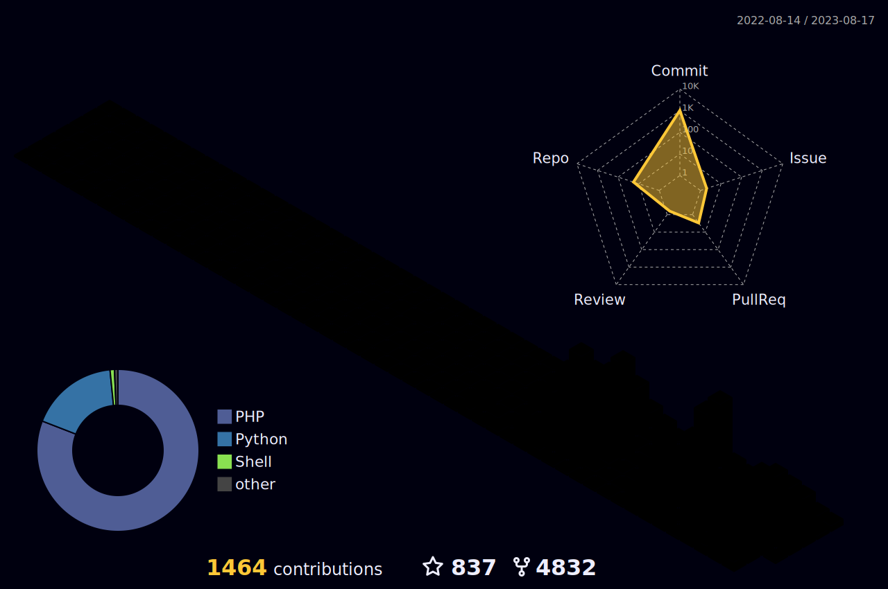

# Mohammad Mehrani

  

  
  
  
  
  
  

  
  
  

## About Me

- Backend and automation focused developer.
- Building practical systems with clean architecture.
- Interested in Python, Go, cloud tools, and DevOps workflows.

## Tech Stack

  

## Project Performance Report

  
  

  

  

  

  
  

## Contribution Views

  

